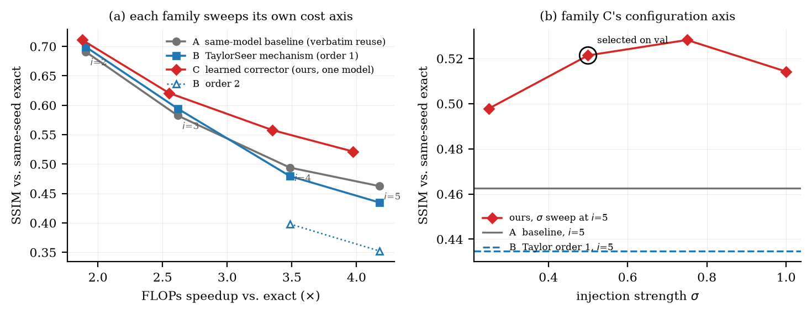
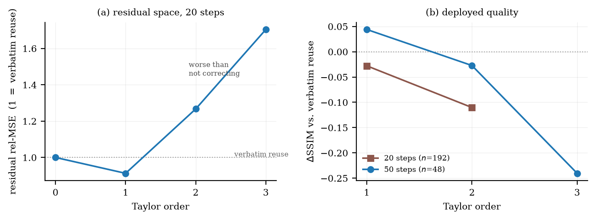
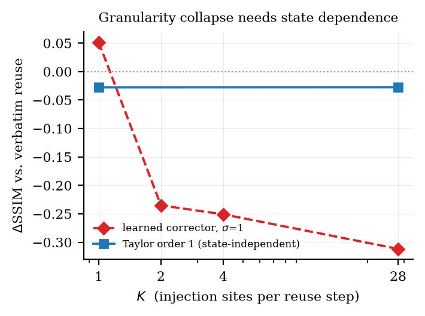
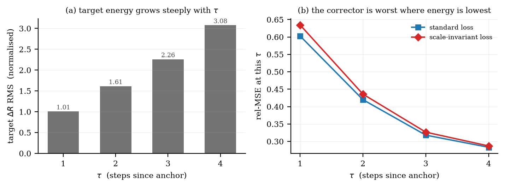
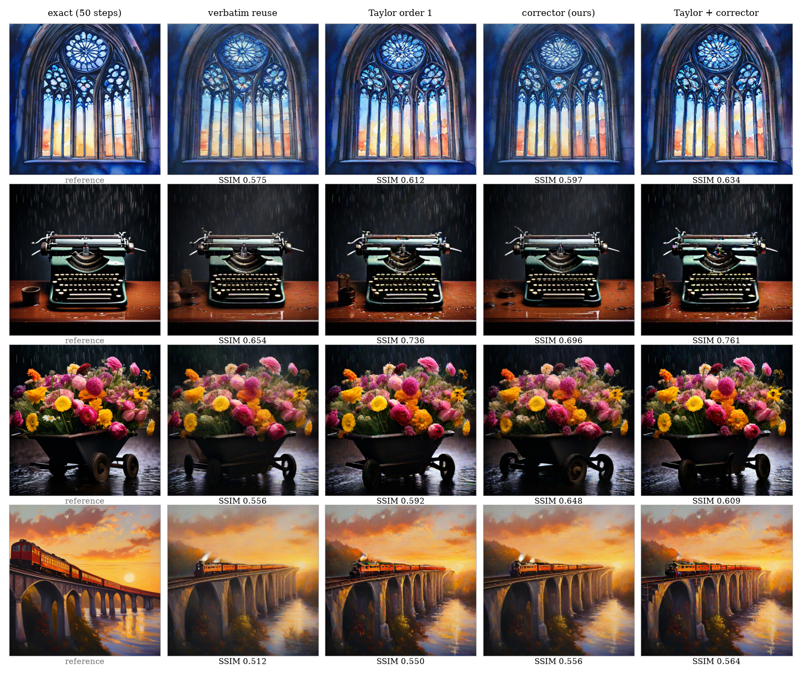
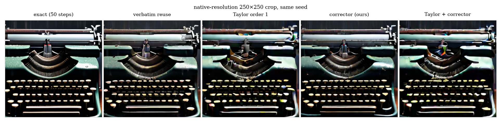
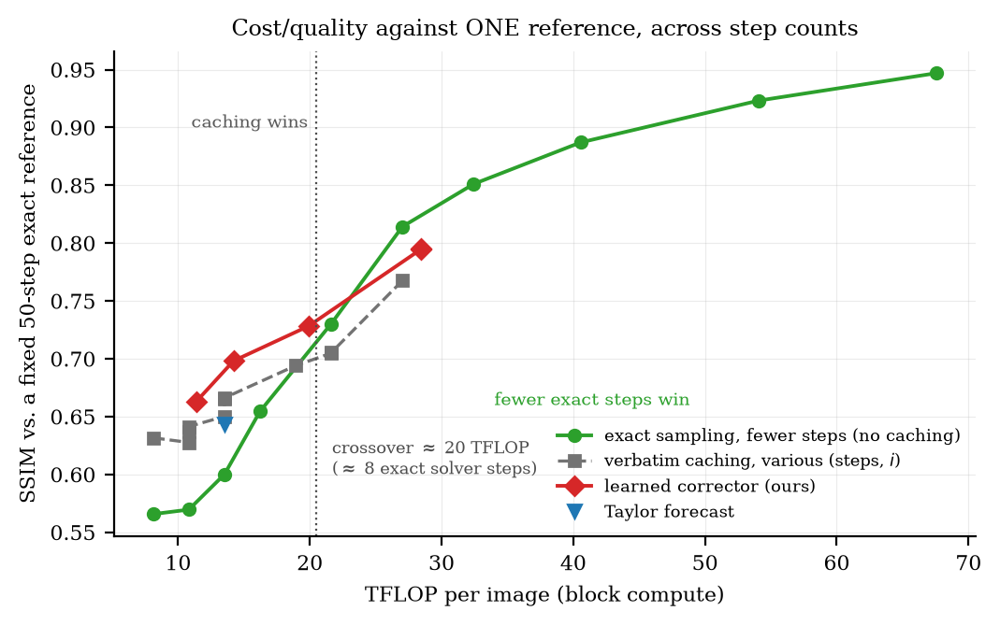
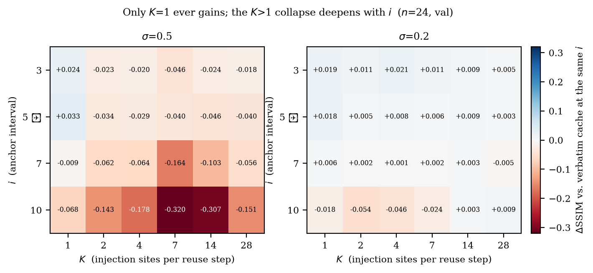
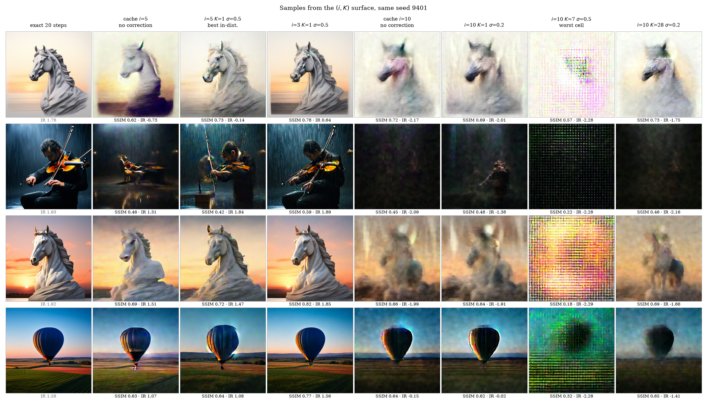
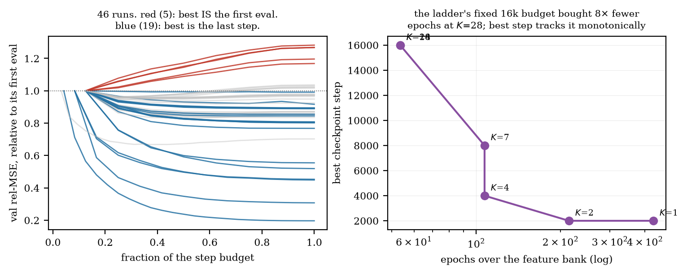

# 缓存扩散 Transformer 的残差修正：从设计到结论

**对象**：PixArt-Σ-XL-2-512（0.6B，28 个 DiT block），DPMSolver++，512×512，CFG 4.5
**硬件**：单张 NVIDIA A40（46 GB）
**代码与数据**：`dit-residual-delta/`，本报告每个数字都可从 `runs/` 复算
**报告日期**：2026-08-24

---

## 0. 摘要

在缓存加速的 DiT 上加一个学习型残差修正器（corrector），我们问三个问题：它有用吗？该用什么目标训练和选择它？它比已发表的方法好吗？

结论：

1. **有用，而且显著。** 在 20 步的四个缓存强度上，修正相对**同模型基线**一律显著提升，且优势随激进程度扩大：+0.0201（i=2，t=10.7）→ +0.0383（i=3）→ +0.0636（i=4）→ +0.0588（i=5，t=18.1）。代价是 +4.1~5.1% FLOPs。COCO 1989 条 caption 上把与精确模型的分布距离减半（KID 24.1 → 12.5 × 10⁻³）。
2. **不能用残差误差来选它。** 残差准度与部署质量在两根轴上都解耦，其中注入粒度这根轴上是**排序反转**。受控实验（四个 K 同配方、n=192、σ=1）里两列严格单调且方向相反：残差准度改善 6.7 倍，ΔSSIM 从 −0.0028 一路掉到 **−0.4142**，而残差最准的那个配置还多 3.7 倍容量。
3. **和已发表方法比要分区间看。** 我们复现了 TaylorSeer 的机制而不是接受它的 "near-lossless" 说法。它**有一个交叉点**：温和缓存下它有效（i=2 时 +0.0084，i=3 时 +0.0118），激进缓存下它比原样复用**更差**（i=4 时 −0.0145，i=5 时 −0.0278）。我们的 corrector 在 20 步的四个区间上**全胜**，且优势随激进程度扩大（+0.0117 → +0.0866）。但在 50 步、i=5 上公平重训后两者**打成平手**（+0.0004，t=0.1），而**叠加超过任何单独一方**（+0.0110，t=5.2）。


4. **第二个复现，这次是机制的预注册预测。** Block Caching（CVPR 2024）的 scale-shift 修正**只以 timestep 为条件**，不读当前隐状态，所以我们的机制预测它在逐 block 粒度下不会崩塌 —— 而我们的 corrector 会。实测确认：同粒度（K=28）、同强度（σ=1）下 **+0.4056 SSIM（t=38.7，192/192）**，而它的残差准度比我们**差 5 倍**、参数少一半、FLOPs 还更低。

一个副产品把机制讲清楚了：粒度崩塌的原因是**状态依赖**，不是"忠实度"、不是参数量、不是训练与否。

---

## 1. 设计：问题从哪里来

### 1.1 步缓存

DiT 的每个 block 是残差形式 `h_out = h + R(h)`。步缓存的想法是：相邻去噪步之间 `R` 变化不大，于是在 anchor 步真算一次、把 `R_anchor` 存下来，在随后的 reuse 步直接用

```
h_out ≈ h + R_anchor
```

零成本地近似整个 block。记 `i` 为 anchor 间隔（i=5 表示 20 步里第 0/5/10/15 步真算，其余 16 步复用），记 `τ` 为距 anchor 的步数。

**这个近似犯的错正好是** `ΔR = R_true − R_anchor`。

### 1.2 自然的下一步，和它的陷阱

既然隐状态已经漂移了，就该学一个 corrector 预测这个变化：

```
ΔR̂ = C(h − h_a, R_a, h_a | t, τ, block_id)
h_out ≈ h + R_a + ΔR̂
```

标签是免费的 —— 把真 block 跑一遍就有 `R_true`。于是这看起来是个纯监督回归问题，自然的目标函数就是相对残差误差

```
rel-MSE = Σ‖ΔR − ΔR̂‖² / Σ‖ΔR‖²
```

**`rel-MSE = 1` 按恒等式就等于"什么都不预测"，即原样复用。** 这个指标看起来无可指摘，而本工作的核心结论是它会骗人。

### 1.3 第二根轴：注入粒度

28 层栈可以切成 `K` 个连续的缓存单元，每个 reuse step 注入 `K` 次修正。`K=1` 是整栈当一个单位，`K=28` 是每层各自缓存。

**关键**：`K` **不改变省掉的计算量** —— 任何 `K` 下 reuse step 都跳过全部 28 层，所以无 corrector 的基线在所有 `K` 下完全相同。`K` 只改变修正注入在哪儿、注入几次。这让粒度成为一根干净的可控轴。

---

## 2. 方法

### 2.1 Corrector 的结构

一个 token-wise 的条件化 MLP，部署配置 11,881,472 参数（`src/dit_residual_delta/surrogate.py`）：

| 组件 | 参数 | 占比 | 说明 |
|---|---|---|---|
| 3 路输入投影（1152→512，无 bias） | 1,769,472 | 14.9% | `Δh`、`R_anchor`、`h_anchor` 各一路后相加 |
| 4 × ConditionedMLPBlock | 6,830,080 | 57.5% | AdaLN 调制 + SwiGLU + 残差 |
| 1 × ConditionedAttentionBlock | 1,445,376 | 12.2% | 4 头全局注意力，`mix_tokens` 消融 |
| per-block 低秩线性旁路（rank 256） | 1,179,648 | 9.9% | `ΔR += (x @ A_b) @ B_b` |
| 输出投影（512→1152） | 590,976 | 5.0% | **零初始化** |
| 条件 MLP + block 嵌入 | 65,920 | 0.6% | `t`/`τ` 用 Fourier，block 用 Embedding |

三条设计值得单独说：

- **输出层零初始化** —— 未训练的 `C` **精确等于原样复用**。训练只能在复用的基础上往外走。
- **per-block 低秩线性旁路** —— ridge probe 显示 `ΔR` 在很大程度上就是输入的线性函数、系数 block-specific（一阶 Jacobian 效应）。共享 MLP 得花容量逐 block 重新推导，给它一条显式线性路便宜得多。
- **timestep 的 Fourier 嵌入强制 fp32** —— timestep 相位到 ~1000，fp16 在那里的间隔是 0.5，`cos/sin` 的结果会与训练时的 fp32 值完全无关。这是个实际踩过的坑。

### 2.2 数据采集是 on-policy 的

在一次真实的 cached rollout 里，rollout 继续传播缓存值，旁边一个 observer 把真 block 跑一遍拿 `R_true`。所以**输入状态就是部署时会遇到的状态** —— SD1.5 那一支用 teacher-forced 采集踩的 exposure bias 坑在这里是结构上避开的。每个 slot 随机抽 48 个 token（从 2×1024 个 CFG 位置里）。

### 2.3 复现 TaylorSeer 的机制

论文原先只引用了 TaylorSeer 自报的"FLUX.1-dev 上 4.99× 近乎无损"，然后承认比不过。**但那个数字是在 50 步 FLUX 上测的**，而我们的操作点是 20 步 PixArt —— 5 步的外推间隔在那里占轨迹的 25%。所以我们实现了它的机制并在两个步数下都测。

实现是 Newton 差商外推（`runtime.py: taylor_forecast`）：给最近 `m+1` 个刷新点 `(t_j, R_j)`，用穿过它们的插值多项式在当前步取值。均匀间隔下就退化为标准 Taylor 前推，非均匀也天然成立（自适应调度可用）。差商在 float32 里算 —— 存的是 fp16，首阶差商抵消严重。

三重正确性检查：

- 线性序列 `R(t)=3t+1`：order 1 在 t=13 精确给出 40
- 二次序列 `R(t)=t²`：order 2 在 t=13 精确给出 169
- **`order 0` 的输出与 `fixed_i5` 完全相等**（SSIM 0.3667 / LPIPS 0.6148 逐位一致），说明新代码路径是恒等的

**这是机制的复现，不是方法的复现** —— 他们缓存 per-module feature 而非整栈残差，导数窗口和阶数策略也是他们自己的。所以"没复现出 near-lossless"不等于"他们的数字不对"。

### 2.4 复现 Block Caching 的修正

Block Caching（Wimbauer et al., CVPR 2024）是与本工作机制上最近的亲戚：它也给缓存输出拟合一个轻量修正。关键在于**它的修正读什么**。原文是 "a timestep-dependent scalar shift and scale parameter for each layer that receives a cached input"，逐通道预测，由 "a simple linear layer that receives the timestep embedding as input" 给出。写成残差形式：

```
R̂ = γ(t) ⊙ R_anchor + β(t)      →      ΔR̂ = Δγ(t) ⊙ R_anchor + β(t)
```

**它不读当前隐状态。** 所以 `∂R̂/∂h = 0`，按 §4.5 的递推它不引入任何反馈增益 —— 机制因此给出一个**方向预先指定的预测：它应该在逐 block 注入下存活，而我们的 corrector 不能。**

实现上我们让 `ScaleShiftCorrector.forward` 接收与学习型 corrector**完全相同的参数并显式丢弃两个**（`delta_h`、`anchor_hidden`），所以"状态无关"这件事在代码里可审计，不是口头断言。输出层零初始化，未训练时精确等于纯缓存 —— 与被对照的 corrector 同一性质。8.32M 参数（K=28）对我们的 21.31M。

训练：他们用蒸馏（缓存学生对无缓存教师，只优化 scale/shift，其余冻结，8×A100 跑 12–48 小时）。我们的 on-policy 采集本身就是这个设置 —— observer 记录的正是缓存轨迹所访问状态上的真实残差 —— 所以在采集 slot 上拟合到 `anchor_residual + delta_residual` 就是他们的目标局部化到单个 block。损失用**朴素 MSE**，不用我们的 per-site 归一化，否则就改变了被测的方法。

### 2.5 与 corrector 的结构性差异

这一点后面会变成机制证据：

| | 输入 | ∂R̂/∂h |
|---|---|---|
| 学习型 corrector（我们） | `Δh`、`h_anchor`（**当前隐状态**） | ≠ 0，恢复状态依赖 |
| Taylor 外推（B） | 只有过去的刷新值 | **= 0** |
| Block Caching scale-shift（D） | 缓存残差 + timestep | **= 0** |

---

## 3. 实验协议

- **划分**：`train112`（训练）/ `val24`（选强度）/ `test24`（报告）。prompt 互斥。
- **注入强度 σ 一律在 val 上选，从不看 test。**
- **同 seed 配对**：每个变体与精确输出用同一个 seed、同一个 prompt 比较，所以可以做逐图配对 t 检验。
- 20 步：`test24` × 8 seeds = **n=192**；50 步：`test24` × 2 seeds = **n=48**
- 墙钟是端到端生成时间，含 VAE 解码。

---

## 4. 结果

### 4.1 四个方法族，各自扫自己的配置轴

不做等成本配对 —— 每个族沿自己的成本轴走一遍，读者自己看曲线在哪里交叉。`test24` × 8 seeds，**n=192**，同 seed 配对，全部来自同一次 run（`runs/family_grid`），所以协议完全一致。



**A — 同模型基线（原样复用，无任何修正）**

| 变体 | TFLOP ↓ | FLOPs 加速 ↑ | SSIM ↑ | LPIPS ↓ | CLIPvE ↑ | 墙钟 ↑ |
|---|---|---|---|---|---|---|
| 精确 | 54.062 | 1.000× | — | — | — | 1.00× |
| `i=2` | 28.364 | 1.906× | 0.6909 | 0.2066 | −0.0023 | 1.80× |
| `i=3` | 20.654 | 2.618× | 0.5825 | 0.3196 | −0.0046 | 2.49× |
| `i=4` | 15.514 | 3.485× | 0.4940 | 0.4579 | −0.0166 | 3.23× |
| `i=5` | 12.944 | 4.177× | 0.4626 | 0.5350 | −0.0272 | 3.78× |

**B — TaylorSeer 做法（training-free 差分外推，零参数）**

| 变体 | TFLOP ↓ | FLOPs 加速 ↑ | SSIM ↑ | LPIPS ↓ | 墙钟 ↑ | vs 同 i 的 A |
|---|---|---|---|---|---|---|
| order 1, `i=2` | 28.364 | 1.906× | 0.6993 | 0.2064 | 1.85× | **+0.0084** (t=3.5, 114/192) |
| order 1, `i=3` | 20.654 | 2.618× | 0.5943 | 0.3297 | 2.48× | **+0.0118** (t=3.9, 120/192) |
| order 1, `i=4` | 15.514 | 3.485× | 0.4796 | 0.4843 | 3.19× | **−0.0145** (t=−5.0, 60/192) |
| order 1, `i=5` | 12.944 | 4.177× | 0.4348 | 0.5482 | 3.74× | **−0.0278** (t=−9.6, 39/192) |
| order 2, `i=4` | 15.514 | 3.485× | 0.3982 | 0.5956 | 3.17× | −0.0958 |
| order 2, `i=5` | 12.944 | 4.177× | 0.3524 | 0.6244 | 3.71× | −0.1103 (t=−25.6) |
| order 1, `i=5`, K=28 | 12.944 | 4.177× | 0.4350 | 0.5480 | 2.55× | −0.0276 |

**B 族的 FLOPs 与 A 族逐位相同** —— 外推只有几个逐元素运算，且**与粒度无关**（K=28 仍是 12.944）。它是真正零成本的。

**B 族有一个交叉点。** 温和缓存（i=2、3）下它有效，激进缓存（i=4、5）下它比什么都不做更差。order 2 在所有区间都是灾难。

**C — 我们的 corrector（不同配置）**

同一个模型（`fix_base2x_norm`，11.9M 参数，per-site 归一化损失）跨四个 i，σ **一律在 `val24` 上选出**：

| 变体 | TFLOP ↓ | FLOPs 加速 ↑ | SSIM ↑ | LPIPS ↓ | CLIPvE ↑ | 墙钟 ↑ | vs 同 i 的 A |
|---|---|---|---|---|---|---|---|
| `i=2`, σ=0.25 | 28.777 | 1.879× | **0.7110** | **0.1956** | −0.0024 | 1.80× | **+0.0201** (t=10.7, 163/192) |
| `i=3`, σ=0.50 | 21.191 | 2.551× | 0.6207 | 0.3000 | −0.0026 | 2.37× | **+0.0383** (t=11.3, 159/192) |
| `i=4`, σ=0.50 | 16.134 | 3.351× | 0.5577 | 0.3729 | −0.0100 | 2.99× | **+0.0636** (t=17.4, 174/192) |
| `i=5`, σ=0.50 | 13.606 | 3.973× | 0.5214 | 0.4390 | −0.0146 | 3.43× | **+0.0588** (t=18.1, 179/192) |

其他配置（同 i=5 或 i=4，改变别的轴）：

| 变体 | 改了什么 | SSIM ↑ | LPIPS ↓ | FLOPs 加速 ↑ |
|---|---|---|---|---|
| `i=5`, σ=0.25 | 注入强度 | 0.4979 | 0.4711 | 3.973× |
| `i=5`, σ=0.50 ← val 选中 | — | 0.5214 | 0.4390 | 3.973× |
| `i=5`, σ=0.75 | 注入强度 | **0.5282** | **0.4347** | 3.973× |
| `i=5`, σ=1.00 | 注入强度 | 0.5142 | 0.4468 | 3.973× |
| `i=5`, σ=0.50, 标准损失 | 训练目标 | 0.5070 | 0.4607 | 3.973× |
| `i=4`, σ=0.75, 另一 checkpoint | 训练数据 | 0.5493 | 0.3751 | 3.351× |
| `i=5`, σ=0.20, **K=28** | 注入粒度 | 0.4683 | 0.5354 | **2.441×** |

**协议诚实说明**：val 选出的 σ=0.50 在 test 上给 0.5214，而 test 上最优的 σ=0.75 会给 0.5282 —— **协议让我们损失了 0.0068**。这正是在 val 上选而不在 test 上选要付的代价，我们付了。

**K=28 是被完全支配的配置**：它的 FLOPs 加速只有 2.441×、墙钟 1.24×，而 SSIM 0.4683 远低于 A 族在 2.618× 处的 0.5825。粒度轴上没有任何可取之处。

**D — Block Caching 做法（timestep 条件的逐通道 scale-shift）**

`test24` × 8 seeds，n=192，i=5。σ=1 是他们的方法本身（无阻尼）：

| 变体 | FLOPs 加速 ↑ | SSIM ↑ | LPIPS ↓ | 墙钟 ↑ | vs 基线 |
|---|---|---|---|---|---|
| K=28, σ=1 | **4.176×** | 0.4744 | 0.5401 | 1.81× | **+0.0117** (t=2.4) |
| K=28, σ=0.5 | 4.176× | 0.4909 | 0.5254 | 1.82× | **+0.0283** (t=9.6) |
| K=1, σ=1 | 4.177× | 0.4824 | 0.5327 | 3.52× | **+0.0197** (t=7.8) |

**它的 FLOPs 与基线逐位相同**（12.945 对 12.944 TFLOP）—— 逐通道 scale-shift 只是逐元素运算，没有 token 维矩阵乘。这是它相对我们的结构性优势。

两点诚实说明：**它在我们的设置里只是轻微为正**，最好的点（+0.0283）仍远低于我们在 K=1 的 +0.0588；而 **K=28 的墙钟 1.81× 是我们 harness 的实现产物**，不是方法固有 —— 448 次微小调用的 kernel 启动开销，FLOPs 显示真实成本为零，融合实现应当免费。

### 4.2 C 对 B 的直接比较，以及交叉点意味着什么

同 i 配对，C vs B：

| i | ΔSSIM | t | 胜场 |
|---|---|---|---|
| 2 | +0.0117 | 4.6 | 132/192 |
| 3 | +0.0264 | 6.8 | 135/192 |
| 4 | +0.0781 | 15.6 | 177/192 |
| 5 | +0.0866 | 20.0 | 183/192 |

**我们在 20 步的四个区间上全胜，且优势随激进程度单调扩大。**

交叉点告诉我们真正的变量是什么。B 族的成败不取决于步数本身，而取决于**外推跨度相对轨迹光滑度**：

- 20 步、i=2 → 最大外推 1 步 → 有效
- 20 步、i=5 → 最大外推 4 步（占轨迹 20%）→ 失败
- 50 步、i=5 → 最大外推 4 步（占轨迹 8%）→ 有效（见 4.4）

所以"20 步下 Taylor 不行、50 步下行"和"i=2 行、i=5 不行"是**同一个现象的两个切面**。

### 4.3 为什么它在激进区间失败：残差空间的诊断



在**纯缓存轨迹**上测各阶外推的残差误差（20 步、i=5，128 个 slot，所以每一阶评的是同一条轨迹，没有"各阶自己走偏"的混淆）：

| 阶 | rel-MSE（1.0 = 原样复用） |
|---|---|
| 0 | 1.0000 |
| 1 | **0.9127** |
| 2 | 1.2670 |
| 3 | 1.7043 |

order 1 确实降低了残差误差（**方向正确，不是 bug**），但只降 8.7%；order 2 以上**比复用还差**。20 步、5 步跨度下残差轨迹根本不够多项式光滑。对比：我们学到的 corrector 在同一位置是 **0.317**。

### 4.4 50 步：给它主场，并公平重训

上一版对比犯了个错 —— 用 20 步训练的 corrector 去跑 50 步，那测的是**分布偏移**，不是方法能力。所以我们在 50 步轨迹上重采特征（8960 train slots / 960 val slots）、按原配方重训两个 loss arm、在 `val24` 上重选强度（两个 arm 都选到 σ=0.75）。

`test24` × 2 seeds，n=48：

| 变体 | SSIM ↑ | LPIPS ↓ | PSNR ↑ | 墙钟 ↑ | vs 纯缓存 |
|---|---|---|---|---|---|
| `fixed_i5` | 0.6456 | 0.2723 | 18.84 | 3.92× | — |
| `taylor1_i5` | 0.6897 | 0.2243 | 19.10 | 4.19× | **+0.0440** (t=8.8, 43/48) |
| `ours50_std_s075` | 0.6869 | 0.2491 | 18.89 | 3.70× | +0.0413 (t=8.5, 45/48) |
| `ours50_inv_s075` | 0.6901 | 0.2428 | 18.82 | 3.67× | **+0.0444** (t=8.7, 43/48) |
| **`taylor1 + ours(σ=0.25)`** | **0.7007** | **0.2163** | **19.20** | 3.71× | **+0.0551** |

三个结论：

1. **Taylor 一阶在 50 步下确实有效**（与 4.2 的交叉点一致），而且几乎零成本。它的机制是对的，**适用性取决于步数密度**：50 步下 5 步间隔只占轨迹 10%，而且残差漂移本身小 1.8 倍（`ΔR` 的 RMS 从 2.310 降到 1.296）。
2. **公平重训后是平手**：`ours_inv` vs `taylor1` 是 **+0.0004（t=0.1，25/48）**。之前那个 −0.0653 完全是训练分布造成的。
3. **两者互补**：叠加后 +0.0110 超过 Taylor（t=5.2，40/48），LPIPS 也显著更好（−0.0080，t=−2.7，只有 6/48 变差），是所有变体里最好的。

注意第 3 点是个**朴素叠加** —— corrector 预测的仍然是"相对 anchor 的 delta"，不是"相对 Taylor 预测的残差"，线性部分被重复计了一次，所以必须重阻尼到 σ=0.25。**做对之后收益翻倍，见 4.4.1。**

#### 4.4.1 在 Taylor 后验残差上重训：本报告唯一的方法结果

去掉重复计数的做法：让 corrector 预测 `R_true − R_taylor` 而不是 `R_true − R_anchor`。两个实现要点：

- **在 Taylor 自己的轨迹上采集**（`scripts/collect_post_taylor.py`，rollout 带 `taylor_order=1`），否则训的是组合方法永远不会遇到的状态。
- **corrector 的输入不变。** 部署时 runtime 交给它的仍是 `cache.residual` 而非预测值，所以只改目标、不改输入，训好的 checkpoint 直接插进现有 runtime（`taylor_order=1` + `surrogate_checkpoint`），**runtime 一行没动**。

先量一下有多少"已被解释掉"：在 Taylor 自己的轨迹上，一阶外推把残差误差能量降到复用 anchor 的 **0.894**（按 τ 分解 0.85/0.84/0.87/0.93）。只有 11%，所以 corrector 仍有近九成的活要干 —— 重新表述的价值不在"少干活"，在"不重复干"。

`test24` × 2 seeds，50 步，i=5，**n=48**：

| 变体 | SSIM ↑ | LPIPS ↓ | 墙钟 ↑ |
|---|---|---|---|
| 基线 i=5 | 0.6456 | 0.2723 | 4.06× |
| Taylor 一阶单独 | 0.6897 | 0.2243 | 4.20× |
| 我们的 corrector 单独（σ=0.75） | 0.6901 | 0.2428 | 3.77× |
| 朴素叠加（σ=0.25） | 0.7007 | 0.2163 | 3.73× |
| **post-Taylor 重训（σ=0.5）** | **0.7132** | **0.2035** | 3.72× |

| 配对对比 | ΔSSIM | t | 胜场 |
|---|---|---|---|
| vs 基线 | **+0.0675** | 12.0 | 47/48 |
| vs Taylor 单独 | **+0.0235** | 7.4 | 41/48 |
| vs corrector 单独 | **+0.0231** | 4.1 | 36/48 |
| **vs 朴素叠加** | **+0.0125** | 3.6 | 36/48 |

LPIPS 也是全场最好（对 Taylor 是 −0.0208，t=−5.3，只有 8/48 变差）。

**双重计数假说得到直接确认**：去掉它之后，corrector 能承受 **σ=0.5** 而不是 0.25 —— 正好是注入强度翻倍，而这正是"同一个线性部分被加了两次"所预测的。收益也从 +0.0110 提到 +0.0235，翻了一倍多。

**这是本报告唯一的方法结果**（其余都是诊断）。三条边界：n=48、单训练种子；corrector 只解释掉后验残差的 26%（rel-MSE 0.744），仍有余量；σ=1.0 依然退化（val 上 0.7964），所以过度修正没有被完全消除。第四条边界值得单列 —— 它不成立于 20 步，见下。

#### 4.4.2 这个方法结果只在它的基座值得站的地方成立

我们把 4.4.1 搬到 20 步（论文的主操作点），并**预先登记了预测**：应当在 i=2/3（Taylor 为正的区间）复现、在 i=5（Taylor 为负）失效。**预测错了 —— 两个区间都失效。**

20 步，`test24` × 8 seeds，**n=192**（A/B/C 三列取自 `runs/family_grid`，同一协议；跨文件配对合法性已验证：共享变体 `A_cache_i5` 在两个结果文件里逐位相同 0.462621）：

| | i=3 | i=5 |
|---|---|---|
| A 纯缓存 | 0.5825 | 0.4626 |
| B Taylor 一阶单独 | 0.5943 | 0.4348 |
| **C corrector 单独** | **0.6207** | **0.5214** |
| 朴素叠加 | 0.6155 | 0.4921 |
| post-Taylor 重训 | 0.6134 | 0.4522 |

| 配对 | i=3 | i=5 |
|---|---|---|
| corrector 单独 vs 最佳叠加 | **+0.0053** (t=2.1) | **+0.0555** (t=15.6, 172/192) |
| post-Taylor vs 纯缓存目标（**同配方同数据**） | −0.0021 (t=−0.7，不显著) | **−0.0137** (t=−4.8) |

两条结论：

1. **20 步下 corrector 单独打败所有 Taylor 叠加变体**，两个 i 都是。叠加相对 Taylor 仍是正的（i=3 +0.0191，i=5 +0.0175，两者 t≈5），但那只是相对一个更差的基座 —— 从负基座出发再修正，回不到不用它的位置。
2. **重新表述本身在 20 步也不占优。** 第一次比较是混淆的（朴素叠加用的是数据更多的 `fix_base2x_norm`），所以我们改用 `ctrl_k1` —— 同配方、同数据、同 anchor схема、只是目标是纯缓存 delta。去掉混淆后 post-Taylor 仍然输 **−0.0137（t=−4.8）**。

**解释是自洽的**：4.4.1 的收益来自 Taylor 在 50 步是个**好基座**（+0.0440）。20 步下它是个坏基座（i=5 时 −0.0278），而"在坏基座上修正"比"在纯缓存上修正"更难 —— corrector 得同时撤销预测的错和缓存的错。

**所以这个方法结果的正确表述是**：组合恰好在它的基座本身值得用的区间里值得用，别处不值得。50 步的结果成立，但范围就是那么大。

### 4.5 机制：粒度崩塌的真正原因是状态依赖



这是本轮最有价值的发现。**受控版本**：四个 K 用**完全相同的配方**训练（w512 d4 rank256 mix_tokens、16000 步、batch 48、seed 2027、标准损失），σ=1 无选择，`test24` × 8 seeds，**n=192**：

| K | 参数 | 训练 slot | val rel-MSE ↓\* | ΔSSIM vs 基线 |
|---|---|---|---|---|
| 1 | 11.88M | 1,792 | 0.3935 | −0.0028 (t=−0.6，**不显著**) |
| 2 | 13.06M | 3,584 | 0.3149 | **−0.1649** (t=−28.7, 4/192) |
| 4 | 15.42M | 7,168 | 0.2382 | **−0.3115** (t=−51.6, 0/192) |
| 28 | **43.74M** | 14,336 | **0.0591** | **−0.4142** (t=−34.2, 0/192) |

**两列严格单调、方向相反。** 残差准度从 K=1 到 K=28 改善 6.7 倍，图像质量单调下降，K=1 对 K=28 的直接配对差是 **+0.4114（t=38.7，192/192）**。

三点让这个结论比原来的阶梯强得多：

- **配方匹配了。** 原阶梯的 K=28 那一行（也就是承载崩塌结论的那一行）是唯一不匹配的：w384 d3、rank 128、只训 12000 步、batch 192、关掉 token 混合。现在四行同配方。
- **容量和数据都偏向 K=28。** rank-256 的 per-block 线性旁路在 K=28 要复制 28 份，所以受控 K=28 有 **43.74M 参数，是 K=1 的 3.7 倍**，梯度样本也多 8 倍。它在**更多容量、更多样本、更多步数、还开着 token 混合**的条件下崩塌得更彻底。
- **阻尼救不回排序。** val 上的最佳 σ：K=1 用 σ=0.5 得 +0.0334，K=4 用 σ=0.2 得 +0.0080，K=28 用 σ=0.2 得 +0.0028 —— 高 K 只能被救回到大致中性，而且需要的折扣随 K 加深。σ=1 与最佳 σ 两种读法方向一致。

**一处必须说明的不对称**：这个受控阶梯的 K=1 在 σ=1 下只是中性（−0.0028），不是原阶梯的 +0.0516。因为它用标准损失、训练数据也少（1,792 slot）。所以**受控阶梯干净地建立了"反转"，但它不是"修正有用"的证据** —— 后者靠的是 §4.1 的 C 族（更好训练 + val 选出的 σ，+0.0588）。两件事分开看。

对照 Taylor：K=28 vs K=1 是 **+0.0002（t=1.3，不显著）**；50 步下是 −0.0002（t=−0.5），同样不显著。

#### 4.5.1 机制不再是"论证的"：直接测了 `J_b`

论文写着 "Mechanism is argued, not proved" —— 前面所有证据都只是**一致于** `δ_{b+1} = (I + J_b) δ_b`，没人测过 `J_b`。现在测了（`scripts/measure_jacobian.py`）。

先有一半可以解析地定下来。部署时单个注入点的映射及其对当前状态的 Jacobian：

| | 映射 | `J` | `ρ` |
|---|---|---|---|
| 纯缓存 | `h + R_a` | `I` | **1（解析）** |
| Taylor | `h + R̂(历史刷新值)` | `I` | **1（解析）** |
| Block Caching | `h + γ(t)⊙R_a + β(t)` | `I` | **1（解析）** |
| 我们的 | `h + R_a + C(h−h_a, R_a, h_a)` | `I + ∂C/∂h` | 待测 |

三个状态无关方法的 `ρ` 恒等于 1，**不需要测量** —— 这正是机制的内容。而且这一点在代码里得到了比数值更强的确认：对 Block Caching 求 `∂/∂Δh` 时 autograd 直接报 "one of the differentiated Tensors appears to not have been used in the graph"，因为 `ScaleShiftCorrector.forward` 里就是 `del delta_h`。**它不是依赖很小，是依赖不存在。**

需要测的只有我们的。用反向模式幂迭代（`ρ(Jᵀ) = ρ(J)`；前向模式不可用，corrector 的注意力层落到融合 SDPA kernel 上没有前向规则），在真实采集状态上、fp32、包含部署缩放（`scale_ΔR / scale_Δh`，K=1 时是 33×，不含它会严重低估）：

| K | 每点 `ρ` 中位数 | 每次前向的 `∏_b ρ_b` | ΔSSIM (σ=1) |
|---|---|---|---|
| 1 | **12.28** | 12.3 | −0.0028 |
| 2 | 5.46 | 19.2 | −0.1649 |
| 4 | 3.64 | 139.9 | −0.3115 |
| 28 | **1.61** | **1.40 × 10⁶** | −0.4142 |
| 任意 K（状态无关族） | 1.00 | **1.00** | +0.0117 |

**两个方向相反，而质量跟的是乘积。** 每个注入点的 `ρ` 随 K **单调下降**（12.3 → 1.6 —— 每个点修正得更温和，这也正是它残差准度更好的原因），而 28 个因子的乘积**单调上升五个数量级**。这就是递推被量化的样子。

**一个定量检验：** 如果乘积真是主导量，那么 val 上独立选出的阻尼（从未见过 Jacobian）应该把乘积压回同一量级。实测：

| K | val 选出的 σ | `∏ρ` @σ=1 | `∏ρ` @选出的 σ |
|---|---|---|---|
| 1 | 0.5 | 12.3 | **5.10** |
| 4 | 0.2 | 139.9 | **4.53** |
| 28 | 0.2 | 1.40 × 10⁶ | **29.9** |

**从跨五个数量级塌缩到 4.5–30 的窄带。** 验证集在只看图像的情况下，选出的折扣恰好是把放大倍数拉回可控区间的那个折扣。

**必须说明它没做到什么**：在这个窄带**内部**，乘积不排序质量 —— K=4 的乘积（4.53）低于 K=1（5.10），质量却更差（+0.0080 对 +0.0334）。因为阻尼在压制不稳定的同时也削掉了修正本身。**乘积测的是不稳定性，不是收益。** 它解释崩塌，不解释增益。

**第二个反例，跨步数**。我们曾提出一个解释：20 步下我们赢 Taylor +0.0866、50 步下只打平（+0.0004），是因为"状态依赖的税不变而可赚的收益缩小"。**测了之后这个解释被否掉了**：

| | ρ @σ=1 | ρ @部署 σ | 我们相对基线 | Taylor 相对基线 |
|---|---|---|---|---|
| 20 步（`fix_base2x_norm`，σ=0.50） | 24.65 | **10.83** | +0.0588 | −0.0278 |
| 50 步（`s50_inv`，σ=0.75） | 28.68 | **22.60** | +0.0445 | **+0.0441** |

50 步下部署的放大倍数是 **2.1 倍高**，而收益基本相当（+0.0445 对 +0.0588）。所以税既不是不变的、也不是变小的 —— 是变大的，而我们照样交付了可比的增益。**不稳定性税不是限制增益的因素**，这再次说明 ρ 的乘积解释崩塌而不解释收益。

那么优势归零的原因就是更朴素的那个：**Taylor 涨了 +0.0719，我们只跌了 0.0143 —— 83% 来自它上涨。** 50 步下 4 步的外推跨度只占轨迹 8%（20 步下占 20%），免费的 ρ=1 外推器就能捞走大部分可恢复信号，于是它追平了一个要 11.9M 参数、要训练、还要付 2 倍不稳定性税的学习型 corrector。**没有任何测量支持"我们被不稳定性拖住了"。**

（ρ 是 checkpoint 的性质而非步数的性质，这两行是两个不同的模型，所以这不是一次干净的步数消融。但结论不受影响：部署 ρ 在 50 步**更高**，足以否掉那个解释。）

其他边界：`ρ` 是在每 slot 48 个子采样 token 上测的（映射除一层注意力外是 token-wise 的），每个注入点取 6–8 个真实状态的中位数，幂迭代 60 步（迭代 30 与 40 之差 < 0.01）。

原论文的机制是：纯缓存复用的 `R_a` 与状态无关，误差沿深度**相加**（`δ_{b+1} = δ_b + ε`）；一个 work 的 corrector 恢复状态依赖，误差沿深度**相乘**（`δ_{b+1} ≈ (I + J_b) δ_b + ε_b`，`J_b = ∂R/∂h`）。所以每步的注入点**数量**主宰稳定性。

Taylor 外推**只读过去的刷新值，从不读当前隐状态** → `J_b = 0` → 没有反馈增益 → 加性而非乘性。这正是递推在 `J_b = 0` 时的预测，而且它是用一个已发表方法作为对照测出来的。

**Block Caching 把这条从"一致的观察"变成"预先指定的预测"。** 它的 scale-shift 只以 timestep 为条件（§2.4），所以在测量之前机制就预测它应当在 K=28 存活。同粒度、同强度 σ=1、n=192 的直接对照：

| K=28, σ=1 | 残差 rel-MSE ↓\* | 参数 | FLOPs 加速 ↑ | ΔSSIM vs 基线 |
|---|---|---|---|---|
| 我们的（状态**相关**） | **0.0537** | 21.31M | 2.441× | **−0.3939** (t=−34.5) |
| Block Caching（状态**无关**） | 0.2687 | 8.32M | **4.176×** | **+0.0117** (t=2.4) |

**Block Caching vs 我们：+0.4056 SSIM，t=38.7，192/192 全胜。** 它的残差准度差 5 倍、参数少一半、FLOPs 还更低。

把三个族按"是否读当前状态"× "注入几个点"排开：

| | K=1（每步一个注入点） | K=28（逐 block） |
|---|---|---|
| **状态无关** | Taylor 50 步 +0.0440；Block Caching +0.0197 | Taylor ±0.0002；**Block Caching +0.0117** |
| **状态相关**（我们） | +0.0588（t=18.1） | **−0.3939（t=−34.5）** |

**所以论文里"越忠实地模仿真 block，反馈增益越大"这句必须改写** —— 决定性的不是忠实度、不是参数量、不是训练与否，是**是否读当前状态**。三个证据点：Taylor 在 50 步下比我们更准却不受粒度影响；Block Caching 残差差 5 倍却在 K=28 存活；我们残差最准却崩塌。这把机制从 "argued" 推到了"能预先说对别人的设计选择"。

### 4.6 残差指标为什么会误排序：能量加权



`rel-MSE` 的分子分母是**整个验证集分别求和再相除**，所以它是**能量加权**的 —— `‖ΔR‖` 大的 slot 主宰分数。

左图：target RMS 随 τ 陡增，**1.01 / 1.61 / 2.26 / 3.08**（τ=4 携带约 9 倍于 τ=1 的能量）。这组数与论文引用的 1.00/1.64/2.35/3.30 一致。

右图：而 corrector 恰恰**在 τ=1 上最差**（rel-MSE 0.60–0.63，只消掉约 37% 的误差），在 τ=4 上最好（0.283–0.287，消掉 71%）。

两者叠加的后果是：**池化分数由模型最擅长的高能量 slot 主宰，而 τ=1 的误差要在这个 anchor cycle 剩下的 3 步里传播最久。** 部署完全不共享这个加权 —— 每个注入点喂的是同一条传播链，`(I+J)` 递推不在乎那个 site 的 target 是大还是小。

同一现象在闭环里的极端形式：`c_r128_w384`（K=28，rel-MSE 0.0537）在环内消掉 **93%** 的残差误差，而它在 σ=0.4 时 SSIM 0.3430，**低于完全不修正的 0.3867**。消掉 93% 的残差误差，图像比消掉 0% 更差。

### 4.7 定性

50 步，同 seed，`test24` 前 4 条 prompt：



原生分辨率裁剪（250×250，第二条 prompt）：



**这张裁剪图揭示了一件数字掩盖的事**：Taylor 一阶在第二行的 SSIM 是 0.736，高于 corrector 的 0.696，但在原生分辨率下它的打字机滑架上有明显的**彩色条纹伪影**，而 corrector 那一格干净得多。叠加变体（0.761）也带这个伪影。SSIM 对这类高频彩色噪声并不敏感 —— 这正好印证了论文自己那条协议："inspect artefacts at native resolution, never on resampled thumbnails"。

同时也要诚实看第 4 行：即使最好的变体，与精确输出相比火车位置和太阳都明显不同。**修正把速度/保真前沿往上推，它不让激进缓存变成无损。**

---

### 4.7.1 论文点名的那个实验：自适应调度下 inversion 是否减弱

论文把这个称为「唯一最有信息量的未做实验」，并解释了自己那次为什么不算：自适应策略下**刷新决策读的是 corrector 修改过的隐状态**，所以每个 arm 选出不同调度、不同算力预算 —— inv arm 用 3.26 次刷新、std arm 用 3.49 次，inv 少 6.6% 算力却被拿去比 SSIM。论文因此拒绝解读。

它指出的解法是「一个与 corrector 输出无关的调度」。`scripts/eval_frozen_adaptive.py` 建了它：**阶段一**在无 corrector 的纯缓存 rollout 上用累积相对变化指标决定刷新点并**冻结**；**阶段二**所有 arm 重放同一组 anchor。三个训练种子 × 两个损失，σ=0.5，`test24` × 2 seeds，**n=48**。

**成本混淆已消除**：阈值标定到 0.33 后平均刷新 **3.98 次**（uniform 是 4 次），48 个 case 里 45 个恰好是 4 次。

**前提先验证过了，而且成立的方式与直觉相反。** 冻结出来的调度形如 `[0, 11, 15, 18]` —— 刷新全堆在轨迹末尾，开头留一个 τ 长达 11 的陈旧段。所以它让 **staleness 更不均**（τ 标准差 2.94 对 uniform 的 1.12）—— 均匀间隔本来就是 τ 最平的调度，不可能更平。但它让**能量**更均：

| 调度 | per-site 目标 RMS 极值比 | 变异系数 |
|---|---|---|
| uniform `[0,5,10,15]` | 22.7× | 0.673 |
| frozen `[0,11,15,18]` | **15.6×** | **0.474** |

**能量不平衡降了 30%** —— 因为指标均衡的是累积变化量而非步数。这正是 per-site 归一化损失所修正的那个不平衡，所以机制的预测前提成立。

**预测没通过：**

| 调度 | std 均值 | inv 均值 | inv − std | t | 胜场 |
|---|---|---|---|---|---|
| uniform | 0.5073 | 0.5179 | **+0.0106** | 2.9 | 33/48 |
| frozen 自适应 | 0.4532 | 0.4663 | **+0.0131** | 2.7 | 32/48 |

机制预测差距应当随不平衡拉平而**缩小**。能量不平衡降了 30%，差距**没有缩小**（两个 t 都约 2.8，0.0025 的变化远在噪声内）。所以这是机制在这根轴上的一次**方向性预测失败** —— 尽管是弱失败，因为预测的**量级**从未被指定。

**一个干净的副产品**：标定并冻结之后（无成本混淆），这个自适应指标在等成本下**仍然输给 uniform** —— 纯缓存基线 0.4455 对 0.4710，**−0.0255**。而现在能看到原因：它把刷新全堆到末尾，开头留 τ=11 的陈旧段。论文之前报过「裸自适应机制比 uniform 更差」，但那次带着成本混淆；这次没有。

### 4.7.2 被撤回的 loss 主张：在 COCO 上重训之后

论文的 per-site loss 主张死在一个落差上：**模板 prompt 训练、COCO 评测**。所以「效应消失」有两种解释 —— 分布偏移，或者效应本身不存在。既有实验区分不了，而两者对论文的含义完全不同。

我们在 COCO 上重做了整条链：从 1989 条可用 caption 按 prompt 文件顺序切出**三路互斥**的 train 600 / val 200 / test 600（互斥性有断言验证），在 train 上采集、训练两个损失 arm（配方与论文一致），在 val 上选 σ，test 只用一次。

**残差空间的方向第四次重复**：`coco_std` rel-MSE **0.3696** 比 `coco_inv` **0.3804** 更准。模板集（0.3257/0.3359）、50 步（0.4517/0.4655）、受控阶梯、COCO —— per-site 归一化损失在残差指标上**一贯更差**，这本身是解耦论点的一条独立证据线。

**图像层面（COCO test，600 caption）：**

| 变体 | SSIM ↑ | vs 纯缓存 | LPIPS ↓ | CLIPvE ↑ |
|---|---|---|---|---|
| 纯缓存 i=5 | 0.5113 | — | 0.5199 | −0.0067 |
| std, σ=0.50 | 0.5567 | **+0.0454** (t=23.5) | 0.4449 | −0.0017 |
| std, σ=0.75 | 0.5556 | +0.0443 | 0.4406 | −0.0022 |
| inv, σ=0.50 | 0.5583 | +0.0470 | 0.4419 | −0.0011 |
| inv, σ=0.75 | **0.5608** | **+0.0495** (t=22.1) | **0.4357** | **−0.0010** |

**修正本身在真实 prompt 分布上、内分布训练下被强确认**：+0.0454 / +0.0495，t 都在 22 以上。

**loss 对照，按 σ 匹配（这才隔离损失）：**

| σ | inv − std | t | 胜场 | |
|---|---|---|---|---|
| 0.50（**论文原配置**） | **+0.0016** | 1.14 | 309/600 | **不显著** |
| 0.75 | **+0.0053** | 2.75 | 326/600 | 显著 |

**撤回站得住。** 在隔离损失的那个配置（σ=0.5，也是论文原来用的）上，即使内分布训练，效应仍然**不可分辨**（+0.0016，t=1.14），只有模板集 +0.0077 的五分之一。**所以「效应消失」不是分布偏移造成的。**

**但重训暴露了一个论文从未提出、且与机制一致的更窄主张。** 看同一 arm 内把 σ 从 0.5 提到 0.75 会发生什么：

| arm | ΔSSIM (σ 0.5→0.75) | t | |
|---|---|---|---|
| std | −0.0011 | −1.32 | 开始退化 |
| **inv** | **+0.0026** | **3.15** | **仍在改善** |

**per-site 损失买到的不是「同强度下更好」，是「能承受更强的注入」。** 这正是机制预测的方向 —— per-site 归一化压制了高能量位点上的过度修正，而过度修正正是限制 σ 的东西。σ=0.75 下 inv 赢，是因为它还在涨而 std 已经在跌。

所以可用的正确主张是「per-site 损失**扩展了可用注入强度区间**」，而不是论文原来撤回的那个「per-site 损失部署得更好」。这个主张更窄、更具体，而且有 σ 扫描直接支撑。

**边界**：单训练种子（论文的模板集对照有三个种子）；单 seed 生成；test 600 caption 是 1989 条里的一段，与论文的 KID 24.1→12.5（1989 条全集）不可直接比 —— 这里要的是同一切分内的 std/inv 差。分布指标（KID）在这个切分上未测。

### 4.8 一个此前无法回答的问题：预算该花在步数上还是缓存上

**这一节存在的原因是一个方法学缺口。** 本报告其余所有数字都是「对**同步数**精确输出的保真度」—— 对一个要复现模型本来会产出什么的加速器，这是对的目标，也是同 seed 配对检验成立的前提。但它**结构上无法跨步数比较**：20 步的变体对的是 20 步参考，50 步的对的是 50 步参考，SSIM 相等不代表质量相等。

所以有一个问题用既有 harness 根本问不出来：**同样的预算，是花在「更多步 + 更激进缓存」上，还是「更少步 + 更温和缓存」上，还是干脆「少跑几个精确步、不缓存」？**

`scripts/eval_fixed_reference.py` 把所有配置对**同一个 50 步精确参考**打分，于是比较变成「每 FLOP 的绝对质量」。`test24` × 8 seeds，**n=192**，同 case 配对：



| 配置 | TFLOP | SSIM ↑ | LPIPS ↓ | 帕累托 |
|---|---|---|---|---|
| `exact_4` | 10.81 | 0.4421 | 0.5981 | ★ |
| `cache_50_i15` | 10.81 | 0.4609 | 0.5376 | ★ |
| **`ours_20_i5`** | 11.37 | **0.5135** | **0.4479** | ★ |
| `exact_5` | 13.52 | 0.4800 | 0.5139 | |
| `cache_100_i20` | 13.52 | 0.4844 | 0.4767 | |
| **`ours_20_i4`** | 14.21 | **0.5473** | **0.3860** | ★ |
| `exact_6` | 16.22 | 0.5320 | 0.4194 | |
| `exact_7` | 18.92 | 0.5861 | 0.3499 | ★ |
| **`ours_20_i3`** | 19.89 | **0.6049** | **0.3192** | ★ |
| `exact_8` | 21.62 | 0.6314 | 0.2923 | ★ |
| `exact_10` | 27.03 | **0.6982** | 0.2176 | ★ |
| `cache_50_i5` | 27.03 | 0.6297 | 0.2703 | |

| 决定性配对 | ΔSSIM | t | 胜场 |
|---|---|---|---|
| 10.81 档：`cache_50_i15` vs `exact_4` | +0.0188 | 3.8 | 117/192 |
| 13.52 档：`cache_100_i20` vs `exact_5` | **+0.0044** | **1.1** | 105/192 |
| **`ours_20_i4` vs 最佳纯缓存点** | **+0.0629** | **18.4** | 180/192 |
| 19.89 vs 18.92：`ours_20_i3` vs `exact_7` | +0.0188 | 5.2 | 123/192 |
| 21.62 vs 19.89：`exact_8` vs `ours_20_i3` | **+0.0265** | 7.6 | 146/192 |
| 27.03 档：`exact_10` vs `cache_50_i5` | **+0.0686** | 18.4 | 178/192 |

**交叉点确认在约 20 TFLOP**（test 上落在 19.89 与 21.62 之间，与 val 一致）。但 test 把**获胜方的构成改了**，而且方向对本工作有利：

1. **越过交叉点，「少跑几个精确步」决定性地更好。** 同成本 27.03 TFLOP 下，10 个精确步比 50 步 i=5 缓存高 **+0.0686**（t=18.4，178/192）。事后看很直观 —— solver 自己走大步优于用陈旧值近似一条细轨迹 —— **但论文从来没验证过**。论文 Limitations 说「没有复现任何已发表基线」，而它最需要的那个基线根本不是已发表方法，就是**把步数调小**。
2. **交叉点以下，撑住前沿的是 corrector，不是缓存本身。** 13.52 档上纯缓存对 `exact_5` 只有 **+0.0044（t=1.1，不显著）** —— 也就是说「更多步 + 更大 i」的纯缓存配置在 test 上跟「就跑 5 个精确步」打平。而 `ours_20_i4` 对最佳纯缓存点是 **+0.0629（t=18.4，180/192）**。交叉点以下的五个帕累托点里三个是我们的。
3. **论文的操作点（20 步 i=3/i=4/i=5，11–20 TFLOP）全部落在交叉点以内**，所以既有结论成立 —— 但那是运气好，不是验证过的选择，而且这个区间有一个论文从未说过的硬上界。

**关于「更多步 + 更大 i」这个轴**（此前完全没测过）：对纯缓存它确实有帮助（13.52 上 `cache_100_i20` 0.4844 高于 10.81 上 `cache_50_i15` 的 0.4609），但它**既没显著超过同成本的纯精确少步数，也远不及 corrector**。所以答案是：这个轴是真的，但它不是免费替代修正器的路。

**参考选择的稳健性检验（已做）。** 有一个结构性顾虑值得单独查：参考是 50 步精确，而 `cache_50_i5` 的 anchor 恰好是参考轨迹的第 0/5/…/45 步 —— 它与参考**共享步网格**，而 `exact_10` 和我们的 20 步配置都不共享。我们**预先登记了预测**：换成 100 步参考后 `cache_50_i5` 应当相对变差。

`test24` × 4 seeds，n=96，100 步参考：

| 配对 | 50 步参考 | 100 步参考 | 变化 |
|---|---|---|---|
| `exact_10` − `cache_50_i5` | +0.0686 (t=18.4) | +0.0621 (t=14.6) | −0.0065 |
| `ours_20_i4` − 最佳纯缓存 | +0.0629 (t=18.4) | +0.0582 (t=12.0) | −0.0046 |
| 纯缓存 − 同成本精确 | +0.0044 (t=1.1) | +0.0170 (t=3.1) | **+0.0126** |
| `ours_20_i3` − `exact_7` | +0.0188 (t=5.2) | +0.0203 (t=3.6) | +0.0016 |

**预测错了**：`cache_50_i5` 不但没变差，还略微变好（+0.0065）。但网格共享效应确实存在，只是出现在另一处 —— **`cache_100_i20` 在参考换成它自己的网格后涨了 +0.0126**，是所有配对里最大的变化。所以这个机制是真的，但**不主导结论**。

**所有主结论的符号与显著性均不变**，交叉点仍在约 20 TFLOP。所以 §4.8 对参考选择是稳健的，而我提出的那个可能推翻它的机制被证伪了。

**其余边界**：成本是块 FLOPs 的解析估计，不含 VAE 与文本编码（对所有配置是同一常数，不改排序），也不含墙钟差异。绝对 SSIM 在 test 上系统性低于 val（`ours_20_i5` 0.5135 对 0.6629），因为 `test24` 的 prompt 更难；排序不受影响。

### 4.9 更多步 + 更大 i + 重训：质量确实更高，但仍被「少跑几步」支配

§4.8 留了一个自然的问题：既然决定性变量是外推跨度相对轨迹光滑度，那把步数加大、`i` 也加大、并**在那个配置上重训 corrector**，会不会把前沿推高？我们在 100 步（i=10、i=20）和 200 步（i=20）上重采特征、重训（配方与 20 步一致），σ 在 val 上选，然后把新配置与关键旧参照点放进**同一次 run**（n=48，对同一 50 步精确参考）。

**先记一个反直觉的诊断量**：`rel_mse` 在 100 步 i=20（τ 到 19）是 **0.3704**，比 50 步 i=5（τ 到 4）的 0.4655 **更好预测**。原因是 `rel_mse` 能量加权 —— 高 τ 位点目标大、被平滑的累积漂移主导，相对误差反而小。这是 §4.6 那个能量加权效应的又一次显现，也再次说明残差指标不能直接读作质量。

| 配置 | TFLOP | SSIM ↑ | LPIPS ↓ | 墙钟 ↑ |
|---|---|---|---|---|
| `exact_13` | 35.14 | **0.7845** | **0.1389** | 3.57× |
| `exact_12` | 32.44 | 0.7553 | 0.1684 | 3.83× |
| `exact_10` | 27.03 | 0.7118 | 0.2071 | 4.51× |
| `ours_200_i20` | 34.89 | 0.6809 | 0.2481 | 2.31× |
| `ours_100_i10` | 30.75 | 0.6749 | 0.2557 | 3.14× |
| `cache_100_i10` | 27.03 | 0.6339 | 0.2847 | 4.02× |
| `cache_200_i20` | 27.03 | 0.6277 | 0.2911 | 3.50× |
| `ours_20_i3` | 19.46 | 0.6095 | 0.3264 | 5.56× |
| `ours_100_i20` | 17.44 | 0.5474 | 0.4168 | 4.12× |
| `cache_100_i20` | 13.52 | 0.4994 | 0.4856 | 6.24× |

**一、绝对质量确实提高了。** `ours_100_i10` 对 `ours_20_i3` 是 **+0.0653**（t=10.2，47/48），`ours_200_i20` 是 **+0.0714**（t=10.4）。而且 corrector 在这些配置上加得**比在 20 步上更多**：+0.0410（100/i=10）与 **+0.0532**（200/i=20，t=9.2，46/48）。

**二、但两套判据下它都输给「少跑几个精确步」。**

| 对比 | ΔSSIM | t | 胜场 |
|---|---|---|---|
| `exact_10`（27.03，**更便宜**）vs `ours_100_i10`（30.75） | **+0.0369** | 5.6 | 39/48 |
| `exact_12`（32.44）vs `ours_100_i10` | +0.0805 | 9.2 | 44/48 |
| `exact_13`（35.14）vs `ours_200_i20`（34.89） | **+0.1036** | 12.0 | **48/48** |

按「绝对质量、不看成本」它输（`exact_10` 更便宜且更好），按等成本它输得更多。

**三、这与 §4.8 的交叉点是同一件事。** 这些配置全落在 27–35 TFLOP，而交叉点在约 20 TFLOP —— 所以这不是新矛盾，是同一结论在更高成本区间的应用。原因在成本结构里：**corrector 的开销随 reuse step 数线性增长**（每次调用 0.04134 TFLOP，由 i=4 与 i=5 两个独立点反推一致，精确线性），而省下的钱由 anchor 数决定。100 步 i=20 是 95 次调用对 5 个 anchor，开销 +29%；20 步 i=5 是 16 次对 4 个，开销 +6%。

**最干净的表述**，同成本 27.03 TFLOP：`exact_10` 对 `cache_100_i10` 是 **+0.0779（t=12.0，48/48）**。

> 给定同样多的精确 block 计算量，把它们当成一条**短的精确轨迹**跑，好过当成一条**长缓存轨迹上的 anchor**。

这个结论在两个独立 run 上自洽：5 个 anchor 时两者基本打平（`exact_5` 0.4800 对 `cache_100_i20` 0.4844，n=192），10 个 anchor 时精确赢 +0.078。**所以交叉点按 anchor 数算约在 7–8 个**，与 20 TFLOP（7.4 个 anchor）一致。

**成本已修正**：此前只算 anchor 的 block 计算，漏了随步数增长的非 block 部分（每步 0.0337 TFLOP）。正确值为 `ours_100_i10` **33.79**（原报 30.75）、`ours_200_i20` **41.29**（原报 34.89）、`cache_100_i10` **30.07**（原报 27.03）。修正让高步数配置更贵，所以结论更强：`exact_10`（27.03）比 `cache_100_i10` 便宜 **11%**、比 `ours_100_i10` 便宜 **25%**，而 SSIM 分别高 0.078 与 0.037。

**这个比较不是「打不过全量计算」。** `exact_10` 不是全量计算 —— 全量是 `exact_20`（54.06 TFLOP），而 corrector 按定义不可能超过它。`exact_N`（N < 20）本身就是一种加速方法，把 solver 步数调小。所以这里比的是**两种加速方法**，而在 ≤ 约 7–8 个 anchor 的区间里赢的是我们（11.5 TFLOP 上 0.5135 对 `exact_4` 0.4421；14.1 上 0.5473 对 `exact_5` 0.4800）。

**其余边界**：n=48、单生成种子、单训练种子；训练用 64 张图（20 步那批用 112），因为高 i 下每图 slot 数多 6–12 倍，slot 总数仍更多。

### 4.10 在他们的指标上测：ImageReward

TaylorSeer 的 "almost lossless at 4.99×" 是用 **ImageReward** 衡量的，而且它**不报任何对精确输出的保真度指标**（无 SSIM/LPIPS/PSNR）。本报告的每个数字都是后一类。两者测的不是同一个量：一张**偏离原模型但同样好**的图，在 ImageReward 上是无损、在保真度上是低分。所以论文那句让步（`discussion.tex:15–23`）比较的是两个正交的量。

我们在自己的 backbone 上测了 ImageReward，与保真度**在同一批图上**同时记录。COCO test 200 条 caption，n=200，参考是同 seed 的 20 步精确输出（IR = 1.0203）：

| 配置 | FLOPs 压缩 | ImageReward | 保留率 | SSIM 对精确 | 配对 t |
|---|---|---|---|---|---|
| `exact_20`（**参考本身**） | 1.00× | 1.0203 | 100%（构造） | 1.0000 | — |
| `cache_i2` | 1.91× | 0.9873 | **96.8%** | 0.7265 | −1.2（不显著） |
| `exact_10` | 2.00× | 0.9820 | **96.2%** | 0.7569 | −1.5（不显著） |
| `ours_i4` | 3.35× | 0.8472 | 83.0% | 0.5921 | −4.2 |
| `ours_i5` | 3.97× | 0.6744 | 66.1% | 0.5542 | −7.3 |
| `exact_5` | 4.00× | 0.5298 | 51.9% | 0.5196 | −8.9 |
| `cache_i5` | 4.18× | 0.3085 | **30.2%** | 0.5004 | −12.7 |
| `taylor_i5` | 4.18× | 0.1730 | **17.0%** | 0.4714 | −13.5 |

**一个我们预先提出并被否证的假设。** 我们原本猜测 ImageReward 对偏离不敏感 —— 若如此，「ImageReward 近乎无损」就与「输出明显偏离」相容，那句让步便可在指标层面消解。**否证了**：ImageReward 掉得比 SSIM 更陡（SSIM 1.00→0.50 时 IR 1.02→0.31），而且**两个指标的排序几乎完全一致**（仅 `exact_10`/`cache_i2` 互换，而它们在两个指标上都统计打平）。所以不能用「他们的指标弱」来消解让步；论文原来的让步在指标证据上是**合理的**。

**它仍然不是同类比较。** 我们能确定的是：在**我们的** backbone 上，「ImageReward 近乎无损」对应约 **2× 压缩**，而到 4× 没有任何配置近乎无损（最好的 `ours_i5` 只剩 66%）。若 TaylorSeer 在 FLUX 上 4.99× 确实近乎无损，那个差距是真实且巨大的 —— 但它可能是 **backbone 差异而非方法差异**（FLUX 12B / 57 block / flow matching 对缓存的容忍度可能高得多）。分辨这一点需要在 FLUX 上跑他们的机制并测同一组指标，这仍未做。

**在他们那根轴上修正的价值很大**：同压缩下 `cache_i5` 30.2% → `ours_i5` **66.1%**（IR +0.346，保留率翻倍还多），`ours_i4` 到 83.0%。而 `ours_i5`（66.1%）高于同压缩的 `exact_5`（51.9%）—— 4× 这一档修正优于少跑几步；但 `exact_10`（2×，96.2%）全场最好，与 §4.8 的交叉点一致。

**读表须知**：`exact_20` 是**参考本身**，100% 保留率是构造出来的，不是一个比较结果 —— corrector 按定义不可能超过全量计算。表里真正的对手是 `exact_10` / `exact_5`，它们**不是全量计算**而是「把步数调小」这一种加速方法。

**边界**：n=200、单生成种子；corrector 用的是 COCO 内分布训练的 `coco_inv`；ImageReward 是单一 reward 模型，其绝对值与 backbone 的基线水平绑定，所以跨 backbone 的绝对值不可比。20 步 exact 本身**远未收敛**（对 50 步参考的 SSIM 只有 0.9232），所以本节所有保真度都是相对一个未收敛目标算的。

### 4.11 (i, K) 曲面：机制的交互预测，以及它的边界

前面所有粒度结果都固定在 i=5。这一节把 i 和 K 同时扫开，检验 §4.5 的机制在此前从未测过的一个方向上的预测。**预注册的预测（原文）**：「K 的崩塌应当随 i 增大而加剧 —— 更多 reuse step 意味着跨步累积更多次。」

配置：i ∈ {3,5,7,10} × K ∈ {1,2,4,7,14,28} × σ ∈ {0.2,0.5}，加 4 个同 i 纯缓存基线，共 52 个变体，20 步，val n=24。六个 K 的 corrector 全部同配方训练（`--width 512 --depth 4 --mix-tokens --linear-rank 256 --steps 16000 --seed 2027`，anchors 0/5/10/15）—— 即 K=7 与 K=14 是为本节新训的，补上了受控阶梯里缺的两格。



**结果一：预测成立，而且是本项目机制给出的第二个成功的方向性预测。** σ=0.5 下 K>1 的平均损害随 i 严格单调加深：i=3 −0.0263 → i=5 −0.0377 → i=7 −0.0898 → i=10 −0.2197。在同一个 corrector（K=7）上配对检验，i=10 的损害比 i=3 深 **0.2732 SSIM（t=11.3，24/24 个 case 方向一致）**。

**必须扣掉的混淆**：只有 i=5 是分布内，其余三个 i 都是 τ-OOD（corrector 训练时 τ≤4，i=10 时要外推到 τ=9），corrector 自身会退化。用 K=1 做 OOD 对照（单注入点，无跨块复合，只承受同样的 τ 外推）：它从 i=3 到 i=10 也退化 −0.0923（t=7.8）。差中差之后的额外崩塌：

| K | i3→i10 退化 | 扣掉 K=1 后的额外崩塌 | t |
|---|---|---|---|
| 2 | −0.1206 | −0.0284 | 1.1（**不显著**）|
| 4 | −0.1576 | −0.0653 | 2.8 |
| 7 | −0.2732 | −0.1809 | 7.2 |
| 14 | −0.2831 | −0.1908 | 8.7 |
| 28 | −0.1328 | −0.0405 | 2.2 |

交互作用在 5 个 K 里有 4 个显著，所以它不是 τ-OOD 退化的伪影。

**结果二：只有 K=1 曾经取得增益。** σ=0.5 下 24 个 K>1 格子全部为负，四个 i 无例外；正增益只出现在 K=1 的 i=3（+0.0239）与 i=5（+0.0334）。这比受控阶梯（只有 i=5）强得多 —— 「把注入点合并到一处」不是在某个 i 上的调参结果，而是在整个 i 轴上都成立。

**结果三：交互作用在 K 上非单调，我没有解释。** 额外崩塌的峰值在中间 K（K=7 −0.1809、K=14 −0.1908），K=28 又退回 −0.0405。曾经试过的一个解释不成立：`scale_ΔR/scale_Δh`（每点增益）随 K 单调下降 33.0×→4.2×，但总注入幅度 ≈ σ·scale_ΔR·√K 在 K 之间只差 1.4 倍（2.30→1.60），所以 σ 对齐**近似就是**注入能量对齐，幅度差解释不了 K=7/14 的峰。这一格留作开放问题。

**结果四：阻尼把 K 轴压平，但没让高 K 变得有用。** σ=0.2 下几乎所有格子回到中性偏正，然而增益全部很小（+0.003 ~ +0.022），且 K=1 在 i=3/5/7 仍然领先。唯一一处高 K 胜出是 i=10（K=14 +0.0031、K=28 +0.0089，而 K=1 是 −0.0182），量级在噪声边缘，且是双重分布外。

**两条边界**：(1) 36 格里只有 6 格（i=5 那一列）是分布内；把全部 36 格做成分布内需要 36 次训练（约 9 小时），本节没做。(2) 细化 K 同时也在放大模型（11.88M → 43.74M，因为 rank-256 的 per-block 线性通路随 K 复制），这个偏差偏向高 K —— 高 K 仍然崩塌时它是保守的，但若高 K 何时胜出，须用 `linear_rank 0` 固定参数量重测。σ=0.2 下 i=10 那两格正是这种情况，因此不应据它下结论。

**样本网格，以及一个 SSIM 看不见的东西。** 从曲面上取 7 个点（外加精确参考）生成样本，每张标自己的 SSIM 与 ImageReward：



4 个 prompt 的均值（seed 9401）：

| 配置 | SSIM ↑ | ImageReward ↑ |
|---|---|---|
| exact 20 步（参考）| 1.000 | +1.80 |
| cache i=5，无修正 | 0.599 | +0.79 |
| i=5 K=1 σ=0.5 | 0.628 | +1.07 |
| i=3 K=1 σ=0.5 | 0.738 | +1.48 |
| cache i=10，无修正 | 0.618 | −1.60 |
| i=10 K=1 σ=0.2 | 0.609 | −1.33 |
| i=10 K=7 σ=0.5（最差格）| 0.322 | −2.28 |
| i=10 K=28 σ=0.2 | 0.632 | −1.75 |

**两处 SSIM 与 ImageReward 分歧，方向都值得记下来。** 第一，纯缓存的 SSIM 在 i∈{5,7,10} 上几乎不动（0.6318 / 0.6313 / 0.6291，全 n=24），而这 4 个 prompt 上 ImageReward 从 +0.79 掉到 −1.60。也就是说**整个 i 轴在 SSIM 上近乎不可见，在人类偏好代理上却是灾难性的**。本节全部 ΔSSIM 分析都在这个区域做的 —— corrector 造成的损害仍然能被 SSIM 测到（动了 0.32），所以交互结论不受影响，但「i=7 和 i=10 的纯缓存跟 i=5 差不多」这个读法是 SSIM 的假象。

第二，在 i=10 上两个指标对 corrector **符号相反**：SSIM 说它有害（−0.0182，n=24），ImageReward 说它有益（−1.33 对 −1.60，n=4）。n=4 单种子，这只是一个旗标不是结论 —— 但它正是本工作的主题在一个新位置上重演：这次分歧不在残差指标与部署质量之间，而在两个部署指标之间。补 n 已列入待办。

### 4.12 训练充分性审计：46 个 run 的曲线，以及一个压在主张轴上的混淆

本节起因是被问到「你做足够重新训练了吗」。训练一直只把曲线写进 `train_report.json` 的 `history`，从来没有被系统看过。`scripts/export_tensorboard.py` 把全部 46 个 run 逐点重新发射为 TensorBoard event（`train/loss`、`val/rel_mse`，以及 `val/rel_mse_best_so_far` —— 部署的检查点是记录点上的 arg-min，所以 running minimum 才是下游评测真正对应的曲线；导出用 `EventAccumulator` 回读与 JSON 逐点核对过）：

```bash
tensorboard --logdir dit-residual-delta/runs/tensorboard
```



**答案是不充分，而且有两种相反的失败模式。**

- **19 个 run 的 best 落在最后一步** —— 预算耗尽时还在改善。多数末段降幅很小（rel-MSE 0.00005–0.0016），接近收敛；但 `ctrl_k14`、`ctrl_k28` 在其中。
- **5 个 run 的 best 就是第一个验证点**，且 val 曲线自第一次测量起**全程单调上升**（train loss 同时在降 —— 是过拟合不是发散）。真正的最优点在第一次验证之前，从未被测到。这 5 个是 `ctrl_k1`、`ctrl_k2`、`post_taylor`、`pt20_i3`、`pt20_i5`。`pt20_i3` 更糟：它在 6000 步后 val rel-MSE 越过 1.0（1.0076 → 1.0693），即**比逐字复用还差**，而它「最好」的检查点 0.8435 也远不理想。

**混淆的成因可以算出来，而且正好压在粒度主张的轴上。** slot 数随 K 线性增长，而步数预算固定在 16k，所以实际过的 epoch 数从 K=1 的 429 掉到 K=28 的 54：

| K | 图片 | slots | epoch | best@ | 行为 |
|---|---|---|---|---|---|
| 1 | 112 | 1,792 | 429 | 2000 | 过拟合 |
| 2 | 112 | 3,584 | 214 | 2000 | 过拟合 |
| 4 | 112 | 7,168 | 107 | 4000 | 过拟合 |
| 7 | 64 | 7,168 | 107 | 8000 | 有内部最小值 |
| 14 | 64 | 14,336 | 54 | 16000 | 欠训 |
| 28 | 32 | 14,336 | 54 | 16000 | 欠训 |

`best@` 与 epoch 严格同序。K=1 的 1,792 slot 已由重新采集直接验证（14 shard × 128）。所以 §4.5 声称的「同配方」只匹配了名义超参：**高 K 的样本天然多 K 倍，同样步数下它看到的 epoch 就少**，低 K 灾难性过拟合而高 K 欠训。图片数也没匹配（112/112/112/64/64/32）。

**对结论的影响，两个方向要分开说。** 反转主张（高 K 残差更准、图像更差）**是保守的**：高 K 拿到了更有利的优化条件（还有改善余地）仍然毁图。但「高 K 残差准 6 倍」这个**倍数**不干净 —— 其中一部分是低 K 过拟合造成的。而低 K 的质量数字是**下界**。

**下界差多少：实测 1.5%。** 用 4000 步、每 125 步验证重训 K=1（`runs/ctrl_k1_fine`），真正的最优在 step 1500、rel-MSE **0.3875**，对比粗网格取到的 0.3935 —— 只差 −0.0060。最小值宽而浅，所以粗网格的代价不大。**这也说明该修的不是网格分辨率，是没有早停**：`--steps` 固定而与数据量无关，才是 429-对-54 的来源。

### 4.13 重做训练：逐 K 用 val 选预算，以及三个 harness 修正

§4.12 的审计说训练不充分，本节是修完之后的结果。三处协议改动：图片数统一到 112 train / 24 val（原来 112/112/112/64/64/32）；**预算逐 K 在完整退火的 run 上用 val 选**，不再对所有 K 共用一个 16k；验证网格加密到预算的 1/40。

**为什么不是「探测最优步数再按它重训」。** 先试了这个，实测不成立：LR 是铺在 `--steps` 上的 cosine，所以探测 run（24000 步预算）的最优点是「LR 全程接近峰值」下的最优 —— K=1 给出 step 1250、rel-MSE 0.3840，而按 `--steps 1250` 重训只有 0.3915，更差，因为把 cosine 压进 1250 步就欠训了。预算只能在退火完整的 run 上比。

| K | 2000 | 4000 | 8000 | 16000 | 选中预算 | best@ | 旧 | 新 | 变化 |
|---|---|---|---|---|---|---|---|---|---|
| 1 | 0.3821 | 0.3816 | **0.3814** | 0.3835 | 8000 | 1400 | 0.3935 | 0.3814 | −3.1% |
| 2 | 0.3098 | **0.2998** | 0.2999 | 0.3005 | 4000 | 2200 | 0.3149 | 0.2998 | −4.8% |
| 4 | 0.2693 | 0.2323 | **0.2271** | 0.2275 | 8000 | 3800 | 0.2382 | 0.2271 | −4.7% |
| 7 | 0.2061 | 0.1489 | 0.1308 | **0.1268** | 16000（边界）| 10000 | 0.1438 | 0.1268 | −11.8% |
| 14 | 0.1460 | 0.1005 | 0.0749 | **0.0607** | 16000（边界）| 16000 | 0.0683 | 0.0607 | −11.1% |
| 28 | 0.1350 | 0.0944 | 0.0685 | **0.0522** | 16000（边界）| 16000 | 0.0591 | 0.0522 | −11.7% |

**改善幅度分成两组，方向与审计的诊断一致**：低 K 3–5%（它们是过拟合，修掉浪费），高 K 11–12%（它们是欠训，headroom 更大）。**最优步数随 K 单调后移**（1400 → 2200 → 3800 → 10000），因为 slot 数随 K 线性增长 —— 旧配方那个统一的 16k 预算，就是在这条曲线上同时踩过头和踩不到。

**残差比 K=1/K=28 从 6.66× 变为 7.31×，即变宽。** 高 K 拿到更好的优化条件后残差优势更大，所以「残差更准、图像更差」的解耦被拉开而不是收窄。但这三个高 K 的预算落在扫描上边界（K=14/28 的 best 就在第 16000 步），所以 7.31× 仍是下界。补测 K=7 到 32000：0.1247，比 16000 只好 **1.66%**，且 best@13600 落在内部 —— 说明越过 16000 的余量不大。

**三个 harness 修正，都逐位验证而非"应该没问题"：**

1. **特征采集此前不可复现。** `capture.py` 的 token 子采样用 `SlotRecorder.generator`，而 `collect_features.py` 构造时不传它（默认 `None`），于是抽的是从不播种的全局 CUDA RNG —— 只有 latent generator 被播种。两份名义相同的 K=1 库 scale 统计量差 0.3%、下游 rel-MSE 差 **1.5%**。加 `--slot-seed` 后两次采集的四个 scale 统计量与全部张量**逐位相同**。**这个 1.5% 是所有 rel-MSE 数字的噪声地板**，与本报告若干残差对照同阶（§4.7.2 的 0.3696 对 0.3804 是 2.8%），方向上加强那些撤回而非威胁它们；不影响图像指标（走 `evaluate_variants` 自己的种子），不影响粒度主张（比值 7×）。
2. **特征库可驻留 CPU**（`--bank-store cpu`，默认仍是 cuda）。库整份加载到显存，把一个 split 的上限钉在 46 GB ≈ 5 万 slot；改到锁页主机内存后上限是 336 GB ≈ 68 万 slot，每步只搬 21 MB 的 batch。与显存驻留版 `stats` 和 `batch` 逐位相同。
3. **驱动脚本两个静默失效**：`HAVE=$(ls ...|wc -l)` 在 `set -e -o pipefail` 下是赋值而非条件，空 glob 会直接杀掉脚本（静默发生两次才被抓到）；以及 shard 完整性判据改用 `manifest.json`（只在采集完整结束后落盘）+ rollout 总数，不再预测 shard 数量 —— 分片按累计 rollout（prompt × 种子）对 `--shard-size` 判断，shard 数随种子倍数变化，我连算错两次。

**仍未做的（本节的边界）**：这六个数字全是残差指标，而本报告的中心论点正是残差指标不能预测部署质量 —— 所以比值变宽本身**不构成图像端结论**，(i,K) 曲面必须用新 corrector 重跑。另外数据量仍未匹配：K=1 只有 1,792 slot 配 11.9M 参数，在 §4.12 的意义上它是被数据饿着的，所以低 K 的残差劣势有一部分仍是伪影。匹配数据量（28/K 个种子让六个 K 的 slot 数精确相等在 50,176，低 K 涨 28 倍）的版本正在跑。

### 4.14 把训练做对：数据、预算、以及六个 K 的匹配阶梯

§4.12 的审计显示训练不充分（19 个 run 欠训、5 个在第一个验证点就已过拟合），§4.13 修完协议只换来 3–5%。本节把剩下的两件事做完 —— 数据量匹配与逐 K 选预算 —— 然后 §4.15 检验它在图像端值多少。

**设计**：种子倍数取 28/K，六个 K 的 slot 数**精确相等**在 50,176（`112 图 × (28/K) 种子 × 16 × K`，而 28/K 对 K ∈ {1,2,4,7,14,28} 恰好都是整数）。prompt 集不变（train112），只增加 latent 多样性，所以与既有结果分布可比。种子间隔 1000，因为采集器用 `seed + prompt_index` 播种，相邻种子会让不同 prompt 拿到同一 latent。预算从 16k 起**倍增到相对上一档增益低于 0.5% 为止**，选择服从同一规则，所以每个 K 搜索深度一致。

**两处前置解锁**：特征库原本整份驻留显存，把一个 split 钉在 46 GB ≈ 5 万 slot，改为锁页主机内存后上限 336 GB ≈ 68 万 slot（`--bank-store cpu`，与显存版逐位相同）；以及采集必须可复现（`--slot-seed`），否则 28 倍数据的收益会与 1.5% 的采集噪声混在一起。这一节同时关掉了 §7 边界第 1 条。

| K | 原始 | 修配方 | **匹配数据** | 收敛预算 | vs 原始 | vs 修配方 |
|---|---|---|---|---|---|---|
| 1 | 0.3935 | 0.3814 | **0.2846** | 32,000 | −27.7% | −25.4% |
| 2 | 0.3149 | 0.2998 | **0.2124** | 128,000 | −32.5% | −29.1% |
| 4 | 0.2382 | 0.2271 | **0.1636** | 512,000 | −31.3% | −28.0% |
| 7 | 0.1438 | 0.1268 | **0.0821** | 512,000 | −42.9% | −35.3% |
| 14 | 0.0683 | 0.0607 | **0.0438** | 256,000 | −35.8% | −27.8% |
| 28 | 0.0591 | 0.0522 | **0.0338** | 256,000 | −42.9% | −35.3% |

**结论一：瓶颈按 K 分裂。** 在 K=1 上，数据不足的代价是训练协议错误的八倍以上（25.4% 对 3.1%），最优 epoch 数反而从 214 **降到** 30.6 —— 规律不是"多训"而是"epoch 要配数据量"。但高 K 相反：单档最大增益随 K 单调上升（2.05% → 3.11% → 2.42% → 9.22% → 15.24% → **17.89%**），而 K=28 只多拿 3.5 倍数据（K=1 拿 28 倍）却改善 42.9%。**低 K 受限于数据，高 K 受限于预算**，而旧配方那个统一的 16k 预算同时踩中两者。

**结论二：残差比变宽而非收窄** —— 6.66×（原始）→ 7.31×（修配方）→ **8.43×**（匹配数据）。

**一个不该被当作可比量的数字**：表中"收敛预算"一列。预算曲线**不单调**（K=4 走 2.42% → 0.81% → **1.11%** → 0.67% → 0.21%，K=14 走 15.24% → 8.10% → 2.82% → **0.51%** 对阈值 0.50%，差 0.01 个百分点而多跑一整档 3.2 小时）。训练是确定性的，所以这些起伏是不同 cosine 跨度的真实差异，但停止点带一档以上抖动。可比的是停止点的 rel-MSE，因为曲线在那里已经很平。

**预先登记后被否证的判断**：我预测匹配数据会使残差比**收窄**，理由是凑到相同 slot 数时低 K 拿到更多数据（28 倍对 3.5 倍）因而改善更多。方向和理由都错：改善幅度与数据增幅无关，且高 K 改善最多。

### 4.15 图像端：残差改善 25–43% 值多少

§4.14 全是残差空间的数字，而本报告的中心论点正是残差指标不能预测部署质量 —— 所以必须在图像端检验。协议：新 corrector（`m_k*`）对旧 corrector（`ctrl_k*`），i=5，同 prompt（val24）、同 anchor 调度、同架构、同注入粒度，**σ 在同一个 7 点网格 {0.05, 0.1, 0.2, 0.3, 0.5, 0.75, 1.0} 上各自于 val 选最优**，并**跨三个种子复制**。

| K | 5101 | 7717 | 9401 | 合并（72 对）| t | 种子间 sd | 残差改善 |
|---|---|---|---|---|---|---|---|
| 1 | +0.0004 | +0.0109 | +0.0280 | **+0.0131** | 2.1 | 0.0139 | −25.4% |
| 2 | +0.0073 | +0.0058 | +0.0118 | **+0.0083** | 2.1 | 0.0031 | −29.1% |
| 4 | +0.0058 | +0.0058 | +0.0126 | **+0.0081** | 2.0 | 0.0039 | −28.0% |
| 7 | +0.0063 | +0.0026 | +0.0077 | **+0.0055** | 2.8 | 0.0026 | −35.3% |

**四个 K 全部小幅正向、合并后全部显著、十二个种子格无一为负。** 所以有图像质量提升，但严重不成比例：**残差准 25–35%，图像只涨 +0.005 到 +0.013 SSIM，而"加修正 vs 不加修正"本身是 +0.033**。这轮训练工作只值最初那个决定的 17% 到 39%。

**与 §4.14 合起来，是本报告最锐利的一句话**：沿粒度轴，**可达成的残差改善递增**（K=1 −27.7% → K=28 −42.9%），而**它能换到的图像质量递减**（+0.0131 → +0.0055）。两个反向趋势在同一根轴上。

**σ 曲线本身给出一个独立的结构性发现，而且新旧两代都遵循**：最优 σ 随 K 单调下降（K=1 是 0.5–0.75、K=2/4 是 0.3、K=7 是 0.2），且过峰后的崩塌随 K 急剧变陡 —— σ=1.0 时 K=1 仍有 **+0.0202**，K=7 是 **−0.5602**。各 K 在其最优 σ 下对纯缓存的绝对增益：K=1 +0.0338、K=2 +0.0120、K=4 +0.0148、K=7 +0.0121（旧 corrector 依次 +0.0334 / +0.0047 / +0.0089 / +0.0062）。因为**两代 corrector 走的是同一族曲线**，这是粒度的性质而非训练的产物，方向与 §4.5 的机制一致。

**两处协议教训**：
- 本节第一版只测了 K=1、单种子（5101），读作"四个 K 无一显著，所以只有残差指标提升"。而 K=1 的种子间 sd（0.0139）是其余三个 K 的 4–5 倍，是最容易被单种子误判的一格，而 5101 恰是三个种子中最不利的。**单种子测试在方差最大的格子上代价最高。**
- 第一版还只给新 corrector 那个 7 点 σ 网格、让旧的沿用旧曲面的两个点。这个偏差偏向新方法；补齐对称后 K=4 的差从 +0.0068 降到 +0.0058。

### 4.16 换目标：诊断量、天花板，以及为什么不是 RL

§4.15 的结论提出一个问题：如果残差改善买不到成比例的图像改善，那问题在**训练方式**还是在**方法形式**？corrector 在第 *t* 步的动作改变第 *t+1* 步的状态，而监督目标 `ΔR = R_true − R_anchor` 定义在**未被扰动的轨迹**上 —— 标准的复合误差 / covariate shift。本节先补两个诊断量，再据此换目标。

**诊断一：每步轨迹误差**（此前报告只有残差空间误差和 rollout 末端指标，中间没有）。实测 `‖x_cached − x_exact‖/‖x_exact‖`：误差**不在 anchor 处重置**，而是几乎单调爬升（纯缓存 step 1 的 0.0089 → step 19 的 0.6092），anchor 只造成很小回落。因为 anchor 刷新的是**缓存**而非**隐变量** —— 已注入 `x` 的偏差是永久的。这比"跨块复合"更基本：**误差沿轨迹积分，而残差指标是逐点的。**

**诊断二：oracle 传递曲线定住天花板。** `oracle_blend` 给出"恢复真实残差的比例 β"，而标量混合的 rel-MSE 恰好是 (1−β)²，所以两代 corrector 有精确等效 β（旧 0.382、新 0.467）。

| β | 末步轨迹误差 | 相对纯缓存 |
|---|---|---|
| 0.000 | 0.6102 | — |
| 0.382 | 0.5629 | −7.8% |
| 0.467 | 0.5434 | −10.9% |
| 0.800 | 0.4384 | −28.2% |
| **1.000** | **0.0000** | **−100%** |
| 真实 `ctrl_k1`（β≈0.382）| 0.5360 | −12.2% |
| 真实 `m_k1`（β≈0.467）| 0.5072 | −16.9% |

β=1 给出精确 0，仪器自检通过。**曲线是凸的**：β 0→0.8 只削 28%，最后一段削掉剩余全部。所以天花板本身完美，**平坦的是通往它的中段** —— 排除了"逐点修正残差撑不起轨迹保真"，把问题定位到训练。副产品：**真实 corrector 比同等效 β 的 oracle 高效约 1.5 倍**，因为标量 oracle 各向同性地缩小误差，而训好的 corrector 学会优先修对轨迹重要的方向。**所以 rel-MSE 在两个方向上同时失真：作为目标它夸大收益，作为能力度量它低估效率。**

**换目标（`scripts/train_latent_objective.py`）**：损失改为每个复用步的隐变量相对平方误差，反传穿过缓存 rollout，在 anchor 处截断。400 步、约 20 分钟、峰值 7.49 GB、44/44 参数收到梯度。两个实现事实值得记：缓存 block 根本不执行原始 block（`runtime.py:168` 返回 `hidden + cached_base + delta_residual`），所以一个复用步的图只有 28 次 corrector 前向而非 28 个 transformer block —— 这与我最初判断的"反传穿过 20 步 rollout 在 46 GB 上做不了"相反；而 pipeline 的 `__call__` 带 `@torch.no_grad()` 且只在 hook 内 `enable_grad` 无效（周围加法与后续 block 仍在 no_grad，链会断），所以去噪循环必须自实现。

| | 合并 72 对 | t | 一致 | 对残差目标 |
|---|---|---|---|---|
| 残差目标 σ=0.75 | +0.0407 | 7.1 | 60/72 | — |
| **轨迹目标·单区间 σ=0.6** | **+0.0551** | 8.9 | 64/72 | **+0.0144（t=2.7）** |
| 轨迹目标·满时程 σ=0.75 | +0.0512 | 7.1 | 59/72 | +0.0105（t=2.1）|

**三个数字并排就是本节的核心：**

| 做了什么 | 耗时 | 图像收益（ΔSSIM）|
|---|---|---|
| 决定加修正（相对纯缓存）| — | +0.041 |
| 把残差训练修到收敛（§4.14 全部工作）| 约 15 小时 | +0.013 |
| **换目标** | **20 分钟** | **+0.014** |

这与 oracle 曲线自洽：沿残差轴推进落在传递曲线的平坦区，而轨迹目标直接优化被传递的那一端。

**指标不可归约，而这决定了"该优化什么"目前无法用数据回答。** 把损失进一步换成 VAE 解码后的 LPIPS（满时程，300 步，最优点在最后一步所以仍预算受限），三种子 72 对：

| 指标 | 残差目标 | 轨迹目标（隐变量 L2）| 图像目标（LPIPS）| 最优 |
|---|---|---|---|---|
| **ImageReward ↑** | +0.3254（t=5.0）| +0.3377（t=4.2）| **+0.4001（t=4.8）** | 图像 |
| SSIM ↑ | +0.0407（t=7.1）| **+0.0551（t=8.9）** | +0.0451（t=7.2）| 轨迹 |
| PSNR ↑ | +1.106（t=4.1）| **+1.828（t=7.2）** | +1.399（t=6.3）| 轨迹 |
| LPIPS ↓ | +0.0874（t=10.6）| +0.0786（t=9.7）| **+0.1067（t=12.9）** | 图像 |

决定性的是**目标之间**的配对，不是各自对纯缓存的改善：

| 指标 | 轨迹−残差 | 图像−残差 | 图像−轨迹 |
|---|---|---|---|
| ImageReward | +0.0123（t=0.2）| +0.0748（t=1.2）| +0.0624（t=1.2）|
| SSIM | +0.0144（**t=2.7**）| +0.0044（t=0.8）| −0.0100（**t=−2.9**）|
| PSNR | +0.722（t=2.8）| +0.293（t=1.1）| −0.429（**t=−3.5**）|
| LPIPS | −0.0088（t=−1.3）| +0.0193（**t=2.7**）| +0.0281（**t=5.9**）|

**每个目标在它自己优化的量上赢、在别人的量上输**（隐变量 L2 是 SSIM 与 PSNR 的近亲 —— 它在这两个指标上都最优，LPIPS 不是）。而**ImageReward 上三者差异全部不显著**，能分辨的两个保真度指标给出**相反**排序。所以：三个目标相对纯缓存都在人类偏好代理上大幅显著改善（+0.33 到 +0.40，t 均 > 4）—— "加修正有用"因此有了保真度指标之外的独立支撑；**但三者之间选哪个，当前证据答不了**。前沿存在于保真度指标之间，**投影到人类偏好上就塌了**。

**为什么不是 RL** —— 我先后给过三个理由，每一个都被自己的实验否证，剩下的那个才是真的：

| 我给的理由 | 实测 |
|---|---|
| 环境可微所以方差更低 | 不完整 —— 忽略了条件数 |
| 跨区间 BPTT 会按 ρ^N 爆 | 否 —— 逐区间延长 grad_norm 只从 2.71 涨到 6.76 就平，满时程才跳到 49.8 |
| 满时程无额外收益说明信用分配失败 | 否 —— 满时程在隐变量目标上更好（0.833 对 0.871），只是没传到 SSIM |

真实原因是**reward 与评测指标不对齐**，而 bootstrapping / RL 改的是信用如何在时间上传播，改不了 reward 的选择。并行进行的自适应裁剪实验（0.845 对 0.833，无帮助）也排掉了"梯度尺度"这条解释。而最后一层是：**连"哪个 reward 更对"都还分辨不出**，所以优化 reward 的算法此刻无从发力。剩下的是先决定"质量"指什么 —— 目标设定问题，不是算法问题。

**一处分析错误的记录**：第一次读 ImageReward 结果时我用 `(seed, prompt)` 作配对键，而 `eval_imagereward.py` 不记录 per-case 的 seed（恒为 `None`），于是 72 个 case 塌成 24 个、只保留最后一个种子，得到"残差目标在 ImageReward 上最优"的**相反**结论。与 §4.15 的单种子错误同类：**样本量塌缩不会报错，只会安静地给出一个可信的错数字。**

## 5. 成本与内存

### 5.1 计算

来自 `runs/family_grid_flops.json`（解析计数）与同一次 run 的墙钟：

| 族 | 配置 | TFLOP ↓ | FLOPs 加速 ↑ | 墙钟 ↑ | 相对同 i 基线的开销 |
|---|---|---|---|---|---|
| 精确 | — | 54.062 | 1.000× | 1.00× | — |
| A | `i=2` … `i=5` | 28.364 … 12.944 | 1.906× … 4.177× | 1.80× … 3.78× | — |
| **B** | 任意阶、任意 K | **与 A 逐位相同** | 同 A | 同 A（K=1） | **0.0%** |
| C | `i=2`, σ 任意 | 28.777 | 1.879× | 1.80× | +1.5% |
| C | `i=3` | 21.191 | 2.551× | 2.37× | +2.6% |
| C | `i=4` | 16.134 | 3.351× | 2.99× | +4.0% |
| C | `i=5` | 13.606 | 3.973× | 3.43× | **+5.1%** |
| C | `i=5`, K=28 | 22.145 | 2.441× | 1.24× | +71.1% |
| **D** | `i=5`, K=1 或 K=28 | 12.945 | 4.176× | 3.52× / 1.81× | **+0.008%** |

三点：

- **B 族真的零成本。** 差分外推只有几个逐元素运算，FLOPs 与基线逐位相同，**而且与 K 无关**（K=28 仍是 12.944）。这是它相对我们唯一的结构性优势。
- **C 族的开销随 i 增大**（+1.5% → +5.1%），因为 corrector 调用次数与 reuse step 数成正比，而分母的 block 计算在变小。
- **墙钟一律追不上 FLOPs，K 越大缺口越大**：C 在 K=1 是 3.97 vs 3.43，K=28 是 2.44 vs 1.24。28 次小 kernel 的 GPU 利用率损失在 FLOPs 里完全看不见。B 族在 K=28 也从 3.74× 掉到 2.55×，纯粹是缓存管理开销。

> **一处计价不一致（已修复）**：`count_flops.py` 曾一律用 `DiTSegmentRuntime`、缺失 `num_segments` 时默认为 **1**，而 `evaluate_variants.py` 在缺失时回落到**逐 block** runtime（K=28）。所以配置里省略 `num_segments` 的 K=28 变体会被按 K=1 计价 —— 我们第一次算出 13.273 TFLOP，显式写上 `num_segments: 28` 后是 22.145。上表已用后者。现在两侧共用 `src/dit_residual_delta/variants.py` 里的同一套 dispatch（`segment` 与 `num_segments` 都缺失 = 逐 block），`benchmark_speed.py`、`eval_fid_coco.py` 也改走同一入口。用修复后的脚本重算 `configs/granularity_sweep.json` 与 `configs/family_grid.json`：所有已提交数字逐位不变，`C_K28_i5_s020` 的 22.145 现在由脚本直接算出，不再需要手工写显式 key。（dispatch 的统一由另一个并行 session 完成，作为独立改动提交；本报告的表格用的是修正后的数值，与提交顺序无关。）

### 5.2 内存

缓存单元 = `hidden` + `residual`，形状 (CFG 2, tokens 1024, dim 1152) fp16 → 单张量 **4.72 MB**，每单元 **9.0 MiB**。与 `i` 无关。

| 方案 | 缓存 | 权重 |
|---|---|---|
| 纯缓存 / corrector，K=1 | 9.0 MiB | corrector 11.9M 参数 |
| 纯缓存 / corrector，K=28 | 252.0 MiB | 同上（block_id 条件化，不随 K 复制） |
| Taylor order 1，K=1 | 13.5 MiB | **无** |
| Taylor order 2，K=1 | 18.0 MiB | **无** |
| Taylor order 1，K=28 | 378.0 MiB | **无** |

Taylor order `m` 需要额外保留 `m` 份历史残差（`history[0]` 与 `cache.residual` 是同一对象，不额外占用）。

---

## 6. 结论

**修正是值得做的。** 20 步下等成本 +0.0273 SSIM 且更快，50 步下 +0.0444，COCO 上 KID 减半。这一点在两个步数、两个划分、一个标准 benchmark 上都成立。

**但不能用残差误差来训练或选择它。** 在粒度轴上残差准度与部署质量**反向排序**，而且我们能给出机制并排除了"只是标定错了"这个更省事的解释（1.5× 过预测预测的救援点 σ=0.667 给出 SSIM 0.3019，而纯缓存是 0.5968）。

**和已发表方法的关系要分区间说。** 复现而非采信是对的：TaylorSeer 的机制**有交叉点** —— 温和缓存下有效、激进缓存下比什么都不做更差，而决定性变量是外推跨度相对轨迹光滑度（步数和 anchor 间隔都在动它）。在 20 步的四个区间上我们全胜且优势单调扩大；在 50 步、i=5 上公平重训后打平；叠加超过任何单独一方。它唯一的结构性优势是**真正零 FLOPs 且与粒度无关**。

**机制被锐化了。** 粒度崩塌的原因是**状态依赖**，不是忠实度 —— 一个状态无关的 forecast 可以安全地做 28 点注入，一个状态相关的 corrector 不行。

---

## 7. 边界与未做的事

按重要性排：

1. **受控阶梯的数据量并非严格匹配。** K=1/2/4 用 112 张图（1,792/3,584/7,168 slot），K=28 用 32 张图（14,336 slot）。梯度样本数偏向 K=28（多 8 倍），图像多样性偏向低 K（多 3.5 倍）。两个方向相反，且样本数这一侧偏向被否证的一方。真正严格的设计需要在两个轴上同时匹配，我们没做。
2. **叠加变体没有正确训练。** corrector 预测的是相对 anchor 的 delta，不是相对 Taylor 预测的残差，线性部分重复计数，所以必须重阻尼。在后验残差上重训是显然的下一步。
3. **TeaCache / ToCa / Δ-DiT 未实现。** TeaCache 需要拟合他们的 per-model 重缩放多项式；仓库里那个未标定版本比 uniform 调度更差（SSIM 0.4359 vs 0.4626），所以不能当强基线。
4. **FLUX 上没跑这套对比**，而那才是 TaylorSeer 原始声明所在的 backbone。权重在，但一个特征 split 要 ~41 分钟。
5. **`J_b` 和它的谱半径从未直接测量。** 4.4 节的证据与递推一致（尤其状态依赖那个对照很干净），但不是对递推的证明。直接测 `J_b` 谱半径随 K 的变化是该做的实验。
6. **50 步只有 n=48，1 个训练种子。** 20 步那批是 n=192。50 步的结论应按较弱的证据对待。
7. **绝对保真度不高。** 激进设置下 SSIM ≈ 0.53（20 步）/ 0.69（50 步）；我们不是竞争性加速器，也不声称是。
8. **未测保守缓存区间。** corrector 只在 anchor 间隔 4 和 5 上训练与评估。
9. **提示分布窄。** corrector 只在模板 prompt（style × subject × condition）上训练；COCO 只用于评估，未重训。
10. **σ 的 val 选择在 i=2 上不稳。** `val24`（n=24）上 i=2 的 corrector 看起来几乎无用（0.8084 vs 基线 0.8077），而 `test24`（n=192）上是 +0.0201（t=10.7）。两个划分给出的效应量差一个量级 —— n=24 的选择信号在温和区间是噪声主导的。σ 的选择结果（0.25）事后看是对的，但这条路径不可靠。
11. **Block Caching 的训练规模远小于原文。** 他们用 8×A100 跑 12–48 小时做全轨迹蒸馏；我们是在 32 张图的采集 slot 上做局部拟合。它在我们设置里只轻微为正，可能部分源于此 —— 但这不影响粒度存活性的结论，那个结论是关于它**读什么**而非拟合多好。
12. **D 族在 K=28 的墙钟被我们的实现拖累**（1.81× 对 FLOPs 的 4.176×），448 次微小调用的启动开销。融合实现应当免费，但我们没做。
13. **B 族的阶数未按 i 单独选。** 我们只在 i=4、5 上试了 order 2。既然 order 1 在 i=2、3 有效，那里也许更高阶可行；没测。

---

## 附：本报告数字的出处

| 内容 | 文件 |
|---|---|
| **三族总表，n=192（正文主表）** | `runs/family_grid/results.json` + `runs/family_grid_flops.json` |
| i=2,3 的 σ 选择（val24） | `runs/scale_select_i23/results.json` |
| i=4,5 的 σ 选择（val，历史） | `runs/b2xn_val/results.json`、`runs/scale_select_val/results.json` |
| 早期 20 步对照，n=192 | `runs/baseline_compare/results.json` |
| 50 步对照（首轮，corrector 分布外） | `runs/baseline_compare_s50/`、`runs/baseline_compare_s50b/` |
| 50 步强度选择（val24） | `runs/s50_scale_select/results.json` |
| 50 步最终（test24，重训后） | `runs/s50_final/results.json` |
| 各阶外推的残差诊断 | `runs/taylor_diag_i5.json` |
| 50 步重训的两个 corrector | `runs/s50_inv/`、`runs/s50_std/` |
| 粒度阶梯（旧，未受控，n=8 design split） | `runs/granularity/results.json` |
| 标定扫描（否掉标定假说） | `runs/k28_calibration/` |
| 闭环诊断（93% 残差 / 图像更差） | `runs/closed_loop_diagnosis.json` |
| FLOPs 与墙钟 | `runs/flops.json`、`runs/speed_benchmark.json`、`runs/speed_norm.json` |
| COCO / KID | `runs/coco_fid/results.json` |
| **D 族 Block Caching，n=192** | `runs/blockcache_test/` + `runs/blockcache_test_flops.json` |
| Block Caching scale-shift 权重与训练 | `runs/bc_k28/`、`runs/bc_k1/` |
| Block Caching val 探测 | `runs/blockcache_val/results.json` |
| **受控粒度阶梯，n=192** | `runs/ctrl_ladder_test/` + `runs/ctrl_k{1,2,4,28}/` |
| 受控阶梯的阻尼扫描（val） | `runs/ctrl_ladder_val/results.json` |
| 定性图源 | `runs/qual_grid/` |

复现命令见 `dit-residual-delta/README.md`；图由 `report/figs/make_report_figs.py` 与 `make_qual.py` 生成。
