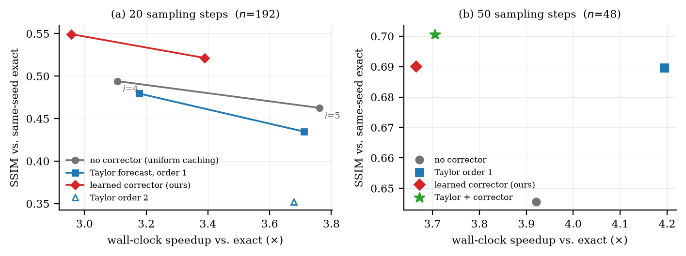

# 缓存扩散 Transformer 的残差修正：从设计到结论

**对象**：PixArt-Σ-XL-2-512（0.6B，28 个 DiT block），DPMSolver++，512×512，CFG 4.5
**硬件**：单张 NVIDIA A40（46 GB）
**代码与数据**：`dit-residual-delta/`，本报告每个数字都可从 `runs/` 复算
**报告日期**：2026-08-24

---

## 0. 摘要

在缓存加速的 DiT 上加一个学习型残差修正器（corrector），我们问三个问题：它有用吗？该用什么目标训练和选择它？它比已发表的方法好吗？

结论：

1. **有用，而且显著。** 20 步下等成本对比，修正把 SSIM 从 0.4940 提到 0.5214（+0.0273，t=8.2），同时更快；COCO 1989 条 caption 上把与精确模型的分布距离减半（KID 24.1 → 12.5 × 10⁻³），代价 +5.1% FLOPs。
2. **不能用残差误差来选它。** 残差准度与部署质量在两根轴上都解耦，其中注入粒度这根轴上是**排序反转** —— 残差准 6 倍的配置把图像毁掉（ΔSSIM −0.3116）。
3. **和已发表方法比是平手，而且互补。** 我们复现了 TaylorSeer 的机制而不是接受它的 "near-lossless" 说法：**它在 20 步下比原样复用更差（−0.0278，t=−9.6），在 50 步下有效（+0.0440，t=8.8）**。在 50 步上公平重训后，我们的 corrector 与它打成平手（+0.0004，t=0.1），而**两者叠加超过任何单独一方**（+0.0110，t=5.2）。

一个副产品把机制讲清楚了：粒度崩塌的原因是**状态依赖**，不是"忠实度"。

---

## 1. 设计：问题从哪里来

### 1.1 步缓存

DiT 的每个 block 是残差形式 `h_out = h + R(h)`。步缓存的想法是：相邻去噪步之间 `R` 变化不大，于是在 anchor 步真算一次、把 `R_anchor` 存下来，在随后的 reuse 步直接用

```
h_out ≈ h + R_anchor
```

零成本地近似整个 block。记 `i` 为 anchor 间隔（i=5 表示 20 步里第 0/5/10/15 步真算，其余 16 步复用），记 `τ` 为距 anchor 的步数。

**这个近似犯的错正好是** `ΔR = R_true − R_anchor`。

### 1.2 自然的下一步，和它的陷阱

既然隐状态已经漂移了，就该学一个 corrector 预测这个变化：

```
ΔR̂ = C(h − h_a, R_a, h_a | t, τ, block_id)
h_out ≈ h + R_a + ΔR̂
```

标签是免费的 —— 把真 block 跑一遍就有 `R_true`。于是这看起来是个纯监督回归问题，自然的目标函数就是相对残差误差

```
rel-MSE = Σ‖ΔR − ΔR̂‖² / Σ‖ΔR‖²
```

**`rel-MSE = 1` 按恒等式就等于"什么都不预测"，即原样复用。** 这个指标看起来无可指摘，而本工作的核心结论是它会骗人。

### 1.3 第二根轴：注入粒度

28 层栈可以切成 `K` 个连续的缓存单元，每个 reuse step 注入 `K` 次修正。`K=1` 是整栈当一个单位，`K=28` 是每层各自缓存。

**关键**：`K` **不改变省掉的计算量** —— 任何 `K` 下 reuse step 都跳过全部 28 层，所以无 corrector 的基线在所有 `K` 下完全相同。`K` 只改变修正注入在哪儿、注入几次。这让粒度成为一根干净的可控轴。

---

## 2. 方法

### 2.1 Corrector 的结构

一个 token-wise 的条件化 MLP，部署配置 11,881,472 参数（`src/dit_residual_delta/surrogate.py`）：

| 组件 | 参数 | 占比 | 说明 |
|---|---|---|---|
| 3 路输入投影（1152→512，无 bias） | 1,769,472 | 14.9% | `Δh`、`R_anchor`、`h_anchor` 各一路后相加 |
| 4 × ConditionedMLPBlock | 6,830,080 | 57.5% | AdaLN 调制 + SwiGLU + 残差 |
| 1 × ConditionedAttentionBlock | 1,445,376 | 12.2% | 4 头全局注意力，`mix_tokens` 消融 |
| per-block 低秩线性旁路（rank 256） | 1,179,648 | 9.9% | `ΔR += (x @ A_b) @ B_b` |
| 输出投影（512→1152） | 590,976 | 5.0% | **零初始化** |
| 条件 MLP + block 嵌入 | 65,920 | 0.6% | `t`/`τ` 用 Fourier，block 用 Embedding |

三条设计值得单独说：

- **输出层零初始化** —— 未训练的 `C` **精确等于原样复用**。训练只能在复用的基础上往外走。
- **per-block 低秩线性旁路** —— ridge probe 显示 `ΔR` 在很大程度上就是输入的线性函数、系数 block-specific（一阶 Jacobian 效应）。共享 MLP 得花容量逐 block 重新推导，给它一条显式线性路便宜得多。
- **timestep 的 Fourier 嵌入强制 fp32** —— timestep 相位到 ~1000，fp16 在那里的间隔是 0.5，`cos/sin` 的结果会与训练时的 fp32 值完全无关。这是个实际踩过的坑。

### 2.2 数据采集是 on-policy 的

在一次真实的 cached rollout 里，rollout 继续传播缓存值，旁边一个 observer 把真 block 跑一遍拿 `R_true`。所以**输入状态就是部署时会遇到的状态** —— SD1.5 那一支用 teacher-forced 采集踩的 exposure bias 坑在这里是结构上避开的。每个 slot 随机抽 48 个 token（从 2×1024 个 CFG 位置里）。

### 2.3 复现 TaylorSeer 的机制

论文原先只引用了 TaylorSeer 自报的"FLUX.1-dev 上 4.99× 近乎无损"，然后承认比不过。**但那个数字是在 50 步 FLUX 上测的**，而我们的操作点是 20 步 PixArt —— 5 步的外推间隔在那里占轨迹的 25%。所以我们实现了它的机制并在两个步数下都测。

实现是 Newton 差商外推（`runtime.py: taylor_forecast`）：给最近 `m+1` 个刷新点 `(t_j, R_j)`，用穿过它们的插值多项式在当前步取值。均匀间隔下就退化为标准 Taylor 前推，非均匀也天然成立（自适应调度可用）。差商在 float32 里算 —— 存的是 fp16，首阶差商抵消严重。

三重正确性检查：

- 线性序列 `R(t)=3t+1`：order 1 在 t=13 精确给出 40
- 二次序列 `R(t)=t²`：order 2 在 t=13 精确给出 169
- **`order 0` 的输出与 `fixed_i5` 完全相等**（SSIM 0.3667 / LPIPS 0.6148 逐位一致），说明新代码路径是恒等的

**这是机制的复现，不是方法的复现** —— 他们缓存 per-module feature 而非整栈残差，导数窗口和阶数策略也是他们自己的。所以"没复现出 near-lossless"不等于"他们的数字不对"。

### 2.4 与 corrector 的结构性差异

这一点后面会变成机制证据：

| | 输入 | ∂R̂/∂h |
|---|---|---|
| 学习型 corrector | `Δh`、`h_anchor`（**当前隐状态**） | ≠ 0，恢复状态依赖 |
| Taylor 外推 | 只有过去的刷新值 | **= 0** |

---

## 3. 实验协议

- **划分**：`train112`（训练）/ `val24`（选强度）/ `test24`（报告）。prompt 互斥。
- **注入强度 σ 一律在 val 上选，从不看 test。**
- **同 seed 配对**：每个变体与精确输出用同一个 seed、同一个 prompt 比较，所以可以做逐图配对 t 检验。
- 20 步：`test24` × 8 seeds = **n=192**；50 步：`test24` × 2 seeds = **n=48**
- 墙钟是端到端生成时间，含 VAE 解码。

---

## 4. 结果

### 4.1 20 步（我们的操作点）



| 变体 | SSIM ↑ | LPIPS ↓ | PSNR ↑ | CLIPvE ↑ | 墙钟 ↑ | vs 同 i 纯缓存 |
|---|---|---|---|---|---|---|
| `fixed_i4` | 0.4940 | 0.4579 | 15.31 | −0.0166 | 3.11× | — |
| `fixed_i5` | 0.4626 | 0.5350 | 14.52 | −0.0272 | 3.76× | — |
| `taylor1_i4` | 0.4796 | 0.4843 | 13.82 | −0.0263 | 3.18× | **−0.0145** (t=−5.0) |
| `taylor1_i5` | 0.4348 | 0.5482 | 13.19 | −0.0357 | 3.71× | **−0.0278** (t=−9.6, 39/192) |
| `taylor2_i5` | 0.3524 | 0.6244 | 12.34 | −0.0702 | 3.68× | **−0.1103** (t=−25.6, 7/192) |
| `ours_i4_s075` | **0.5493** | **0.3751** | **15.72** | **−0.0095** | 2.96× | +0.0553 |
| `ours_i5_s050` | 0.5214 | 0.4390 | 15.54 | −0.0146 | 3.39× | +0.0588 (t=18.1, 179/192) |

**Taylor 外推在 20 步下显著比原样复用更差**，两个 i 都是，四个指标同向。我们的 corrector 对它是 **+0.0866 SSIM（t=20.0，183/192 胜）**。

等成本读法：`ours_i5_s050` 在 3.39× 下 0.5214，`fixed_i4` 在 3.11× 下 0.4940 —— **又快又好，+0.0273（t=8.2）**。

### 4.2 为什么 Taylor 在这里失败：残差空间的诊断


在**纯缓存轨迹**上测各阶外推的残差误差（i=5，128 个 slot，所以每一阶评的是同一条轨迹，没有"各阶自己走偏"的混淆）：

| 阶 | rel-MSE（1.0 = 原样复用） |
|---|---|
| 0 | 1.0000 |
| 1 | **0.9127** |
| 2 | 1.2670 |
| 3 | 1.7043 |

order 1 确实降低了残差误差（**方向正确，不是 bug**），但只降 8.7%；order 2 以上**比复用还差**。20 步下残差轨迹在 5 步跨度上根本不够多项式光滑。对比：我们学到的 corrector 在同一位置是 **0.317**。

### 4.3 50 步：给它主场，并公平重训

上一版对比犯了个错 —— 用 20 步训练的 corrector 去跑 50 步，那测的是**分布偏移**，不是方法能力。所以我们在 50 步轨迹上重采特征（8960 train slots / 960 val slots）、按原配方重训两个 loss arm、在 `val24` 上重选强度（两个 arm 都选到 σ=0.75）。

`test24` × 2 seeds，n=48：

| 变体 | SSIM ↑ | LPIPS ↓ | PSNR ↑ | 墙钟 ↑ | vs 纯缓存 |
|---|---|---|---|---|---|
| `fixed_i5` | 0.6456 | 0.2723 | 18.84 | 3.92× | — |
| `taylor1_i5` | 0.6897 | 0.2243 | 19.10 | 4.19× | **+0.0440** (t=8.8, 43/48) |
| `ours50_std_s075` | 0.6869 | 0.2491 | 18.89 | 3.70× | +0.0413 (t=8.5, 45/48) |
| `ours50_inv_s075` | 0.6901 | 0.2428 | 18.82 | 3.67× | **+0.0444** (t=8.7, 43/48) |
| **`taylor1 + ours(σ=0.25)`** | **0.7007** | **0.2163** | **19.20** | 3.71× | **+0.0551** |

三个结论：

1. **Taylor 一阶在 50 步下确实有效**，而且几乎零成本。它的机制是对的，**适用性取决于步数密度**：50 步下 5 步间隔只占轨迹 10%，而且残差漂移本身小 1.8 倍（`ΔR` 的 RMS 从 2.310 降到 1.296）。
2. **公平重训后是平手**：`ours_inv` vs `taylor1` 是 **+0.0004（t=0.1，25/48）**。之前那个 −0.0653 完全是训练分布造成的。
3. **两者互补**：叠加后 +0.0110 超过 Taylor（t=5.2，40/48），LPIPS 也显著更好（−0.0080，t=−2.7，只有 6/48 变差），是所有变体里最好的。

注意第 3 点是个**朴素叠加** —— corrector 预测的仍然是"相对 anchor 的 delta"，不是"相对 Taylor 预测的残差"，线性部分被重复计了一次，所以必须重阻尼到 σ=0.25。**在后验残差上重训 corrector 是显然的下一步，本报告没做。**

### 4.4 机制：粒度崩塌的真正原因是状态依赖


这是本轮最有价值的发现。学习型 corrector 沿粒度轴崩塌，而 Taylor **完全不受影响**：

| K | 学习型 corrector（σ=1） | Taylor order 1 |
|---|---|---|
| 1 | +0.0516 | −0.0278 |
| 2 | −0.2352 | — |
| 4 | −0.2509 | — |
| 28 | **−0.3116** | **−0.0276** |

Taylor 的 K=28 vs K=1 是 **+0.0002（t=1.3，不显著）**；50 步下是 −0.0002（t=−0.5），同样不显著。

原论文的机制是：纯缓存复用的 `R_a` 与状态无关，误差沿深度**相加**（`δ_{b+1} = δ_b + ε`）；一个 work 的 corrector 恢复状态依赖，误差沿深度**相乘**（`δ_{b+1} ≈ (I + J_b) δ_b + ε_b`，`J_b = ∂R/∂h`）。所以每步的注入点**数量**主宰稳定性。

Taylor 外推**只读过去的刷新值，从不读当前隐状态** → `J_b = 0` → 没有反馈增益 → 加性而非乘性。这正是递推在 `J_b = 0` 时的预测，而且它是用一个已发表方法作为对照测出来的。

**所以论文里"越忠实地模仿真 block，反馈增益越大"这句需要改写** —— 决定性的不是忠实度，是**是否读当前状态**。Taylor 在 50 步下比我们更准，却完全不受粒度影响。这把机制从 "argued" 往 "tested" 推了一步。

### 4.5 残差指标为什么会误排序：能量加权


`rel-MSE` 的分子分母是**整个验证集分别求和再相除**，所以它是**能量加权**的 —— `‖ΔR‖` 大的 slot 主宰分数。

左图：target RMS 随 τ 陡增，**1.01 / 1.61 / 2.26 / 3.08**（τ=4 携带约 9 倍于 τ=1 的能量）。这组数与论文引用的 1.00/1.64/2.35/3.30 一致。

右图：而 corrector 恰恰**在 τ=1 上最差**（rel-MSE 0.60–0.63，只消掉约 37% 的误差），在 τ=4 上最好（0.283–0.287，消掉 71%）。

两者叠加的后果是：**池化分数由模型最擅长的高能量 slot 主宰，而 τ=1 的误差要在这个 anchor cycle 剩下的 3 步里传播最久。** 部署完全不共享这个加权 —— 每个注入点喂的是同一条传播链，`(I+J)` 递推不在乎那个 site 的 target 是大还是小。

同一现象在闭环里的极端形式：`c_r128_w384`（K=28，rel-MSE 0.0537）在环内消掉 **93%** 的残差误差，而它在 σ=0.4 时 SSIM 0.3430，**低于完全不修正的 0.3867**。消掉 93% 的残差误差，图像比消掉 0% 更差。

### 4.6 定性

50 步，同 seed，`test24` 前 4 条 prompt：


原生分辨率裁剪（250×250，第二条 prompt）：


**这张裁剪图揭示了一件数字掩盖的事**：Taylor 一阶在第二行的 SSIM 是 0.736，高于 corrector 的 0.696，但在原生分辨率下它的打字机滑架上有明显的**彩色条纹伪影**，而 corrector 那一格干净得多。叠加变体（0.761）也带这个伪影。SSIM 对这类高频彩色噪声并不敏感 —— 这正好印证了论文自己那条协议："inspect artefacts at native resolution, never on resampled thumbnails"。

同时也要诚实看第 4 行：即使最好的变体，与精确输出相比火车位置和太阳都明显不同。**修正把速度/保真前沿往上推，它不让激进缓存变成无损。**

---

## 5. 成本与内存

### 5.1 计算

| 变体 | TFLOP ↓ | FLOPs 加速 ↑ | 墙钟 ↑ |
|---|---|---|---|
| 精确 | 54.062 | 1.000× | 1.00× |
| `fixed_i4` | 15.514 | 3.485× | 3.11× |
| `fixed_i5` | 12.944 | 4.177× | 3.76× |
| `ours K=1, i=5` | 13.606 | 3.973× | 3.39× |
| `ours K=28, i=5` | 22.145 | 2.441× | 1.25× |
| `taylor1 K=1, i=5` | ≈ `fixed_i5` | ≈4.18× | 3.71× |
| `taylor1 K=28, i=5` | ≈ `fixed_i5` | ≈4.18× | 2.54× |

- corrector 在 K=1 下的代价是 **+5.1% FLOPs**（12.944 → 13.606），即 4.18× → 3.97×。
- **Taylor 的 FLOPs 代价可忽略** —— 只有几个逐元素运算，墙钟与纯缓存无法区分（同一 `fixed_i5` 在两次测量里是 3.92× 和 4.13×，方差就有这么大，不要过度解读排序）。
- **墙钟一律追不上 FLOPs，且 K 越大缺口越大**（K=1 是 3.97 vs 3.39，K=28 是 2.44 vs 1.25）。28 次小 kernel 调用的 GPU 利用率损失在 FLOPs 里完全看不见。
- **K=28 在速度上本身就不划算**，与画质无关。

### 5.2 内存

缓存单元 = `hidden` + `residual`，形状 (CFG 2, tokens 1024, dim 1152) fp16 → 单张量 **4.72 MB**，每单元 **9.0 MiB**。与 `i` 无关。

| 方案 | 缓存 | 权重 |
|---|---|---|
| 纯缓存 / corrector，K=1 | 9.0 MiB | corrector 11.9M 参数 |
| 纯缓存 / corrector，K=28 | 252.0 MiB | 同上（block_id 条件化，不随 K 复制） |
| Taylor order 1，K=1 | 13.5 MiB | **无** |
| Taylor order 2，K=1 | 18.0 MiB | **无** |
| Taylor order 1，K=28 | 378.0 MiB | **无** |

Taylor order `m` 需要额外保留 `m` 份历史残差（`history[0]` 与 `cache.residual` 是同一对象，不额外占用）。

---

## 6. 结论

**修正是值得做的。** 20 步下等成本 +0.0273 SSIM 且更快，50 步下 +0.0444，COCO 上 KID 减半。这一点在两个步数、两个划分、一个标准 benchmark 上都成立。

**但不能用残差误差来训练或选择它。** 在粒度轴上残差准度与部署质量**反向排序**，而且我们能给出机制并排除了"只是标定错了"这个更省事的解释（1.5× 过预测预测的救援点 σ=0.667 给出 SSIM 0.3019，而纯缓存是 0.5968）。

**和已发表方法的关系是平手加互补，不是落后。** 复现而非采信是对的：TaylorSeer 的机制在 20 步下比原样复用更差，在 50 步下有效；公平重训后两者打平；叠加超过任何单独一方。

**机制被锐化了。** 粒度崩塌的原因是**状态依赖**，不是忠实度 —— 一个状态无关的 forecast 可以安全地做 28 点注入，一个状态相关的 corrector 不行。

---

## 7. 边界与未做的事

按重要性排：

1. **叠加变体没有正确训练。** corrector 预测的是相对 anchor 的 delta，不是相对 Taylor 预测的残差，线性部分重复计数，所以必须重阻尼。在后验残差上重训是显然的下一步。
2. **TeaCache / ToCa / Δ-DiT 未实现。** TeaCache 需要拟合他们的 per-model 重缩放多项式；仓库里那个未标定版本比 uniform 调度更差（SSIM 0.4359 vs 0.4626），所以不能当强基线。
3. **FLUX 上没跑这套对比**，而那才是 TaylorSeer 原始声明所在的 backbone。权重在，但一个特征 split 要 ~41 分钟。
4. **`J_b` 和它的谱半径从未直接测量。** 4.4 节的证据与递推一致（尤其状态依赖那个对照很干净），但不是对递推的证明。直接测 `J_b` 谱半径随 K 的变化是该做的实验。
5. **50 步只有 n=48，1 个训练种子。** 20 步那批是 n=192。50 步的结论应按较弱的证据对待。
6. **绝对保真度不高。** 激进设置下 SSIM ≈ 0.53（20 步）/ 0.69（50 步）；我们不是竞争性加速器，也不声称是。
7. **未测保守缓存区间。** corrector 只在 anchor 间隔 4 和 5 上训练与评估。
8. **提示分布窄。** corrector 只在模板 prompt（style × subject × condition）上训练；COCO 只用于评估，未重训。

---

## 附：本报告数字的出处

| 内容 | 文件 |
|---|---|
| 20 步对照，n=192 | `runs/baseline_compare/results.json` |
| 50 步对照（首轮，corrector 分布外） | `runs/baseline_compare_s50/`、`runs/baseline_compare_s50b/` |
| 50 步强度选择（val24） | `runs/s50_scale_select/results.json` |
| 50 步最终（test24，重训后） | `runs/s50_final/results.json` |
| 各阶外推的残差诊断 | `runs/taylor_diag_i5.json` |
| 50 步重训的两个 corrector | `runs/s50_inv/`、`runs/s50_std/` |
| 粒度阶梯（学习型，n=8 design split） | `runs/granularity/results.json` |
| 标定扫描（否掉标定假说） | `runs/k28_calibration/` |
| 闭环诊断（93% 残差 / 图像更差） | `runs/closed_loop_diagnosis.json` |
| FLOPs 与墙钟 | `runs/flops.json`、`runs/speed_benchmark.json`、`runs/speed_norm.json` |
| COCO / KID | `runs/coco_fid/results.json` |
| 定性图源 | `runs/qual_grid/` |

复现命令见 `dit-residual-delta/README.md`；图由 `report/figs/make_report_figs.py` 与 `make_qual.py` 生成。
